# 02 — Generic Agent Runtime

> **Audience:** all implementers. This is the most important architecture document.
> **Purpose:** define the `GenericAgent` interface, the agent type taxonomy, the capability-based discovery model, and the contracts that make every agent — present and future — plug-and-play. No component outside this document may depend on a specific agent product (Claude Code, Hermes, OpenHands, Cline, etc.).

---

## 1. Core principle

**The Supervisor orchestrates capabilities, not products.** Every agent — whether built-in, third-party, or written by a user — implements the same `GenericAgent` interface and advertises a `CapabilityManifest`. The Supervisor asks the Agent Registry: *"which agents can handle capability X?"* and chooses based on health, load, cost, and track record. It never asks *"give me Claude Code"*.

This is what makes the system future-proof. When a new coding agent ships (Codex CLI v3, Gemini CLI v2, a hypothetical "Claude Code 2"), it is added by writing a new `GenericAgent` implementation and registering it. The Supervisor, the Task Orchestrator, the Memory, the Security Layer, the Dashboard — none of them change.

Claude Code and Hermes are referenced throughout this document, but always as **examples of implementations**, never as architectural dependencies.

## 2. The `GenericAgent` interface

Every agent — including the Supervisor itself — implements the following 11-method interface. The interface is a Python `Protocol` (structural typing) with a corresponding `ABC` for runtime enforcement. Implementations may be in-process Python classes, subprocess wrappers, or remote services — the interface is identical.

```python
from typing import Protocol, AsyncIterator
from aaios.core.contracts import (
    AgentIdentity, CapabilityManifest, TaskRequest, TaskProgress,
    TaskResult, HealthReport, MetricsReport, PermissionRequest,
    AgentState, PermissionDecision,
)

class GenericAgent(Protocol):
    """The contract every AAiOS agent must satisfy."""

    # --- identity & lifecycle ---
    @property
    def identity(self) -> AgentIdentity:
        """Stable identity: agent_id, agent_type, version, vendor, signature."""
        ...

    async def initialize(self, context: AgentContext) -> None:
        """
        Called once at agent boot. Acquire resources, open connections,
        verify environment, register with the Agent Registry. Must be
        idempotent — calling initialize on an already-initialized agent
        is a no-op. Raises AgentInitError on failure; the registry will
        mark the agent unhealthy and not route tasks to it.
        """
        ...

    async def shutdown(self, graceful: bool = True) -> None:
        """
        Release all resources. If graceful=True, finish in-flight tasks
        (up to a timeout) before exiting. If graceful=False, abort
        immediately (used on catastrophic failure or system shutdown).
        Must not raise — shutdown errors are logged but never propagated.
        """
        ...

    # --- capability discovery ---
    async def discover_capabilities(self) -> CapabilityManifest:
        """
        Return the agent's capability manifest. Called by the Agent
        Registry at registration time and on hot-reload. The manifest
        is the ONLY mechanism by which the Supervisor learns what an
        agent can do. Agents must NOT advertise capabilities they do
        not actually implement — the QA Agent will detect mismatches.
        """
        ...

    # --- task execution ---
    async def execute_task(self, request: TaskRequest) -> TaskResult:
        """
        Execute a single task synchronously (from the caller's POV —
        internally the agent is free to spawn subtasks, call models,
        etc.). Returns the final TaskResult. May raise TaskFailedError
        or TaskCancelledError. Long-running tasks should use
        stream_progress instead.
        """
        ...

    def stream_progress(self, request: TaskRequest) -> AsyncIterator[TaskProgress]:
        """
        Async iterator yielding progress events as the task runs. The
        final yield is a TaskProgress with kind='result' carrying the
        TaskResult. Used by the Supervisor for long-running tasks so
        the dashboard can show live progress. Agents that don't have
        meaningful intermediate progress may just yield the result.
        """
        ...

    async def cancel_task(self, task_id: str, reason: str) -> None:
        """
        Cooperatively cancel an in-flight task. The agent should
        stop work as soon as it reaches a safe checkpoint, clean up
        partial state, and raise TaskCancelledError from execute_task
        / stream_progress. Must be idempotent — cancelling an already-
        cancelled or completed task is a no-op. Cancellation must be
        fast (target: <2 seconds) but safe (no corrupted state).
        """
        ...

    # --- health & metrics ---
    async def report_health(self) -> HealthReport:
        """
        Return current health: healthy | degraded | unhealthy, plus
        a human-readable reason and a list of failing subsystems.
        Called by the registry on a heartbeat schedule (default 10s)
        and on-demand by the Supervisor before dispatch.
        """
        ...

    async def report_metrics(self) -> MetricsReport:
        """
        Return operational metrics: tasks_completed, tasks_failed,
        avg_latency_ms, p95_latency_ms, tokens_consumed, cost_usd,
        custom_metrics. Used by the Telemetry service and the
        dashboard's per-agent analytics.
        """
        ...

    # --- permissions ---
    async def request_permission(self, request: PermissionRequest) -> PermissionDecision:
        """
        Ask the user (via the Permission Manager) for approval to
        perform a sensitive action. The agent calls this BEFORE
        performing the action — never after. The Permission Manager
        surfaces the request to the user and returns the decision.
        Agents must respect denials without retry.
        """
        ...

    # --- state persistence (for checkpointing & migration) ---
    async def serialize_state(self) -> AgentState:
        """
        Return a serializable snapshot of the agent's internal state
        (open files, in-flight context, cached credentials reference,
        workflow position). Used for: (a) checkpointing long tasks,
        (b) migrating an agent between hosts, (c) crash recovery.
        Must be deterministic — two calls in the same state return
        equal snapshots. Must not contain secret material (use
        SecretRef placeholders).
        """
        ...

    async def restore_state(self, state: AgentState) -> None:
        """
        Restore a previously serialized state. Called after a crash
        or migration. The agent must verify the state is compatible
        with its current version; if not, raise StateIncompatibleError
        and the registry will start the agent fresh.
        """
        ...
```

### 2.1 Implementation rules

The interface above is **non-negotiable**. The following rules apply to every implementation:

1. **All methods are async.** No blocking I/O. CPU-bound work offloaded to a process pool.
2. **All arguments and returns are Pydantic models.** No bare dicts, no `Any`, no untyped `**kwargs`.
3. **Methods must be idempotent where indicated** (`initialize`, `shutdown`, `cancel_task`).
4. **Methods must not block indefinitely.** Every method has a configurable timeout (default 30s for `execute_task` is enforced at the Supervisor level; `report_health` must return in <2s; `discover_capabilities` in <5s).
5. **Methods must not log secret material.** The `AgentContext` provides a `SecretResolver` that returns `SecretRef` objects; the agent materializes values only at the point of use and never logs them.
6. **Methods must emit events.** Every `execute_task` call emits at least `agent.task.started` and `agent.task.finished` on the Event Bus, with the task ID, agent ID, and capability used.

### 2.2 Implementation styles

Three styles are supported, all satisfying `GenericAgent`:

| Style | When to use | Example |
|-------|-------------|---------|
| **In-process** | Computationally cheap, pure-Python, no isolation needed | Reflection Agent, QA Agent (deterministic parts) |
| **Subprocess bridge** | External CLI, language isolation, crash isolation needed | Claude Code Agent (wraps `claude` CLI), Hermes Agent (wraps `hermes` daemon) |
| **Remote service** | Heavy agent deployed separately, multi-instance | A GPU-bound Vision Agent running on a dedicated box |

The Supervisor does not know which style an agent uses. The Agent Registry does, and uses it for health-check strategy and resource accounting, but it never leaks this detail to the Supervisor.

## 3. Agent type taxonomy

The system defines **16 agent types**. Each type is an interface (a Python Protocol extending `GenericAgent` with type-specific methods and a capability vocabulary). Multiple implementations may exist per type. The Supervisor selects by capability, then by implementation quality (track record, health, cost).

```mermaid
flowchart TD
    GA[GenericAgent<br/>11-method interface]
    GA --> SUP[SupervisorAgent]
    GA --> PLAN[PlannerAgent]
    GA --> CODE[CodingAgent]
    GA --> DESK[DesktopAgent]
    GA --> RES[ResearchAgent]
    GA --> BRWS[BrowserAgent]
    GA --> MEM[MemoryAgent]
    GA --> REFL[ReflectionAgent]
    GA --> QA[QAAgent]
    GA --> SEC[SecurityAgent]
    GA --> DEP[DeploymentAgent]
    GA --> VIS[VisionAgent]
    GA --> VOICE[VoiceAgent]
    GA --> DOC[DocumentAgent]
    GA --> WFE[WorkflowAgent]
    GA --> CUST[CustomAgent<br/>plugin-provided]

    CODE --> CC[Claude Code Agent<br/>one implementation]
    CODE --> OH[OpenHands Agent<br/>future implementation]
    CODE --> CLN[Cline Agent<br/>future implementation]
    CODE --> ROO[Roo Code Agent<br/>future implementation]
    CODE --> GEM[Gemini CLI Agent<br/>future implementation]
    CODE --> CDX[Codex CLI Agent<br/>future implementation]

    DESK --> HER[Hermes Agent<br/>one implementation]
    DESK --> AUTO[AutoHotkey Agent<br/>future implementation]
    DESK --> PYWG[Pywinauto Agent<br/>future implementation]

    style GA fill:#d1ecf1
    style CC fill:#fff3cd
    style HER fill:#fff3cd
```



### 3.1 SupervisorAgent
- **Role:** the orchestrator-in-chief. Owns the task lifecycle. Calls the Planner, dispatches to specialized agents, invokes Reflection, Self-Correction, and QA. The Supervisor is itself an agent — it can be replaced (e.g., a different supervisor with a different planning algorithm).
- **Type-specific methods:** `submit_goal(goal) -> TaskId`, `pause(task_id)`, `resume(task_id)`, `rollback(task_id, step_id)`, `override(task_id, decision)`.
- **Capabilities advertised:** `supervise.task`, `supervise.plan`, `supervise.dispatch`, `supervise.reflect`, `supervise.correct`, `supervise.qa`.

### 3.2 PlannerAgent
- **Role:** decompose a natural-language goal into an ordered (or DAG) plan of steps. Each step has: a goal, a capability requirement (not an agent name), a success criterion, a rollback hint, and an optional `parallel_with` field.
- **Type-specific methods:** `decompose(goal, context) -> Plan`, `revise(plan, feedback) -> Plan`.
- **Capabilities advertised:** `plan.decompose`, `plan.revise`.

### 3.3 CodingAgent
- **Role:** software engineering — read/write/refactor code, run tests, manage git, code review, terminal execution. **Claude Code is one implementation of this type.** Future implementations: OpenHands, Cline, Roo Code, Gemini CLI, Codex CLI.
- **Type-specific methods:** `read_file(path)`, `write_file(path, content)`, `run_tests(scope)`, `git(operation, args)`, `shell(command, sandbox)`, `review(diff)`.
- **Capabilities advertised:** `code.read`, `code.write`, `code.refactor`, `code.review`, `test.run`, `git.*`, `shell.execute`.
- **Implementation contract:** every CodingAgent must work behind a project-scoped filesystem sandbox and a shell sandbox. The Security Layer enforces this; the agent cannot bypass it.

### 3.4 DesktopAgent
- **Role:** desktop automation — UI automation, mouse, keyboard, browser, OCR, screenshots, application control, filesystem. **Hermes is one implementation of this type.** Future implementations: AutoHotkey-based, pywinauto-based, OS-native.
- **Type-specific methods:** `open_app(name)`, `close_app(pid)`, `click(x, y)`, `type_text(text)`, `screenshot()`, `ocr(region)`, `find_element(selector)`, `manage_file(op, path)`.
- **Capabilities advertised:** `desktop.ui.*`, `desktop.input.*`, `desktop.screen.*`, `desktop.app.*`, `desktop.file.*`, `browser.*`.
- **Implementation contract:** DesktopAgents require explicit per-task user approval for full desktop control. The Permission Manager enforces this.

### 3.5 ResearchAgent
- **Role:** web research — search, fetch, summarize, cite. Multiple implementations possible (different search backends).
- **Capabilities advertised:** `web.search`, `web.fetch`, `web.summarize`, `cite.format`.

### 3.6 BrowserAgent
- **Role:** interactive web — fill forms, click, extract data from rendered pages. Distinct from ResearchAgent (which is read-only) — BrowserAgent can submit forms, log in (with permission), interact with SPAs.
- **Capabilities advertised:** `browser.navigate`, `browser.click`, `browser.input`, `browser.extract`, `browser.screenshot`.

### 3.7 MemoryAgent
- **Role:** memory operations — recall, summarize, forget, link, rank. Wraps the Memory Manager service for agents that need to manipulate memory directly.
- **Capabilities advertised:** `memory.recall`, `memory.summarize`, `memory.forget`, `memory.link`, `memory.rank`.

### 3.8 ReflectionAgent
- **Role:** critique an agent output against the step goal. Pure-function agent (no side effects). Cheap model by default.
- **Capabilities advertised:** `reflect.critique`.

### 3.9 QAAgent
- **Role:** validate a deliverable against a success criterion. Deterministic where possible (lint, tests, schema validation), LLM-based where necessary (semantic correctness, tone).
- **Capabilities advertised:** `qa.validate`, `qa.lint`, `qa.test`, `qa.schema`.

### 3.10 SecurityAgent
- **Role:** perform security analysis — scan code for vulnerabilities, audit configurations, review permissions, validate plugin manifests. Distinct from the Security Layer (which is infrastructure); the Security Agent is a callable specialist.
- **Capabilities advertised:** `security.scan`, `security.audit`, `security.review`.

### 3.11 DeploymentAgent
- **Role:** handle deployment operations — build artifacts, push to registries, deploy to environments, roll back. Works through the gateway (no direct shell).
- **Capabilities advertised:** `deploy.build`, `deploy.push`, `deploy.release`, `deploy.rollback`.

### 3.12 VisionAgent
- **Role:** analyze images and video — caption, detect, OCR complex layouts, compare images. Uses vision-capable models via the Model Router.
- **Capabilities advertised:** `vision.caption`, `vision.detect`, `vision.ocr`, `vision.compare`.

### 3.13 VoiceAgent
- **Role:** speech-to-text and text-to-speech. Optional in v1; the interface exists so voice support can be added without architectural changes.
- **Capabilities advertised:** `voice.stt`, `voice.tts`.

### 3.14 DocumentAgent
- **Role:** document operations — create, edit, convert, extract from PDF/DOCX/XLSX/PPTX. Distinct from CodingAgent (which works on code) and DesktopAgent (which works on the screen).
- **Capabilities advertised:** `doc.create`, `doc.edit`, `doc.convert`, `doc.extract`.

### 3.15 WorkflowAgent
- **Role:** execute saved, reusable workflows. Wraps the Workflow Engine for cases where a user wants to invoke a workflow as a single "agent call" inside a larger plan.
- **Capabilities advertised:** `workflow.run`, `workflow.validate`.

### 3.16 CustomAgent (plugin-provided)
- **Role:** anything else. A plugin can register an agent that implements `GenericAgent` and advertises any capability namespace not in the reserved list above. The Supervisor treats it identically to built-in agents.
- **Capabilities advertised:** any `custom.*` namespace.

## 4. Capability manifest

Every agent — at registration time — returns a `CapabilityManifest`:

```python
class CapabilityManifest(BaseModel):
    agent_id: str                     # e.g. "claude-code-v1"
    agent_type: AgentType             # one of the 16 types
    implementation_name: str          # "Claude Code" (display name)
    version: str                      # semver
    vendor: str                       # "Anthropic" / "AAiOS" / "third-party"
    signature: str | None             # publisher signature (None for unsigned)
    capabilities: list[Capability]    # what it can do
    resource_requirements: ResourceRequirements  # CPU, memory, GPU, disk
    supported_models: list[str] | None  # None = uses Model Router's choice
    permissions_required: list[Permission]  # what it needs at minimum
    config_schema: dict | None        # JSON schema for agent-specific config
    health_check: HealthCheckSpec     # how to probe health
    timeout_defaults: TimeoutDefaults # default timeouts per operation
    cost_model: CostModel | None      # how to estimate cost per task
    track_record_ref: str | None      # reference to memory track record
```

A `Capability` is:

```python
class Capability(BaseModel):
    namespace: str                    # e.g. "code.write"
    description: str
    input_schema: dict                # JSON schema for inputs
    output_schema: dict               # JSON schema for outputs
    cost_estimate: CostEstimate       # rough cost per invocation
    requires_permission: Permission   # permission gate
    side_effects: list[SideEffect]    # what it affects (fs/net/shell/memory)
```

The Supervisor's Capability Selector queries this manifest, never the agent's class or name.

## 5. Capability-based selection

The selection algorithm (in the Supervisor's Capability Selector):

```mermaid
flowchart TD
    A[Planner produces a step<br/>with capability requirement] --> B[Query Agent Registry:
        SELECT agents WHERE capabilities CONTAINS step.requirement
        AND health = healthy
        AND not in cooldown]
    B --> C{Multiple candidates?}
    C -->|no candidates| X[Task paused: no agent can handle]
    C -->|one candidate| G[Dispatch]
    C -->|multiple| D[Score each candidate:
        1. track record success rate (40%)
        2. current load (20%)
        3. estimated cost (20%)
        4. estimated latency (15%)
        5. user preference override (5%)]
    D --> E[Pick highest score]
    E --> F[Log selection reasoning
        to event bus + audit log]
    F --> G[Dispatch via Agent Registry.handle]
    G --> H[Stream progress to supervisor]
```

The user can pin a specific implementation for a capability namespace (e.g., "always use ClaudeCode for `code.write`") from the dashboard. This is recorded as a user preference and contributes to the score (5% weight by default; can be made decisive).

## 6. Agent Registry

The Agent Registry is the single source of truth for "which agents exist and what can they do." It is a service (L2), depended on by the Supervisor (L4) and exposed to the Dashboard (L5) for monitoring.

### 6.1 Responsibilities
- **Discovery** — at boot, scan Python entry points + plugin manifests for `GenericAgent` implementations. Instantiate each, call `initialize`, call `discover_capabilities`, store the manifest.
- **Indexing** — maintain a `capability -> [agent_id]` index for O(1) capability lookups.
- **Health monitoring** — call `report_health` on each agent on a heartbeat schedule (default 10s). Mark agents degraded/unhealthy based on the response or on timeout.
- **Lifecycle** — `enable(agent_id)`, `disable(agent_id)`, `reload(agent_id)`, `uninstall(agent_id)`. Hot-reload preserves in-flight tasks (they finish on the old instance; new tasks go to the new instance).
- **Versioning** — multiple versions of the same agent can coexist (e.g., `claude-code-v1` and `claude-code-v2`). The Selector picks the version with the best track record unless the user pinned a version.
- **Dependency resolution** — agents can declare dependencies on other agents (e.g., a Deployment Agent may depend on a Coding Agent for building). The registry resolves the dependency graph at registration time and refuses cycles.
- **Capability indexing** — every capability namespace is indexed. Reserved namespaces (`code.*`, `desktop.*`, etc.) are validated against the type taxonomy.

### 6.2 API

```python
class AgentRegistry(Protocol):
    async def register(self, agent: GenericAgent) -> AgentId: ...
    async def unregister(self, agent_id: AgentId) -> None: ...
    async def get(self, agent_id: AgentId) -> GenericAgent: ...
    async def list(self, filter: AgentFilter | None = None) -> list[AgentSummary]: ...
    async def find_by_capability(self, cap: str) -> list[AgentSummary]: ...
    async def enable(self, agent_id: AgentId) -> None: ...
    async def disable(self, agent_id: AgentId) -> None: ...
    async def reload(self, agent_id: AgentId) -> None: ...
    async def heartbeat(self) -> dict[AgentId, HealthReport]: ...
```

### 6.3 Hot reload semantics
When an agent is reloaded (e.g., a new version of the plugin was installed):
1. The new instance is `initialize`d in parallel with the old.
2. The new instance's `discover_capabilities` is verified against the old. If capabilities shrank, in-flight tasks using the missing capabilities are allowed to finish; no new tasks are dispatched to the old instance for those capabilities.
3. Once the new instance is healthy, the old instance is given a `shutdown(graceful=True)` with a 60-second timeout.
4. If the new instance fails to initialize, the old instance continues serving — the reload is rolled back, and the failure is logged.

## 7. Implementation-agnostic contracts

The following invariants guarantee that **no agent implementation detail leaks into the core**:

| Invariant | Enforcement |
|-----------|-------------|
| The Supervisor never imports an agent's class directly. | Static analysis: `supervisor/` may not import from `agents/<impl>/`. |
| The Supervisor never references an agent by implementation name. | Static analysis: regex ban on `"claude"`, `"hermes"`, `"openhands"`, etc. in `supervisor/`. |
| Agent-specific config keys live in a per-agent namespace. | Config schema validation: `agents.<id>.*` only. |
| Agent-specific events use a generic envelope. | Event schema: `agent.event` with `agent_id`, `event_type`, `payload`. |
| Agent-specific permissions are namespaced. | Permission catalog: `<agent_id>.<capability>`. |
| Agent state is opaque to the Supervisor. | `AgentState` is a `bytes` blob with a `format` field; only the agent interprets it. |

If any of these invariants is violated, CI fails. This is the only way to guarantee that swapping Claude Code for OpenHands (or any future agent) requires zero changes to the core.

## 8. Future-agent compatibility

The user listed these future agents that must be addable without core changes:

| Future agent | Agent type | How it would be added |
|--------------|-----------|----------------------|
| Claude Code | CodingAgent | Built-in (Phase 7) |
| Hermes | DesktopAgent | Built-in (Phase 8) |
| OpenHands | CodingAgent | Plugin: implement `GenericAgent`, register, done |
| Roo Code | CodingAgent | Plugin (VS Code extension bridge) |
| Cline | CodingAgent | Plugin (VS Code extension bridge) |
| Gemini CLI | CodingAgent | Plugin (subprocess bridge to `gemini` CLI) |
| Codex CLI | CodingAgent | Plugin (subprocess bridge to `codex` CLI) |
| Custom agents | CustomAgent | Plugin (any of the 3 implementation styles) |
| Future MCP agents | Any | MCP servers expose tools; an MCP-backed agent wraps them behind `GenericAgent` |

The migration path for a user who wants to switch from Claude Code to OpenHands:
1. `aaios plugins install openhands-agent`
2. (Optional) Pin `code.*` to OpenHands in the dashboard, or let the Selector pick based on track record.
3. Done. The Supervisor, Memory, Security, Dashboard — all unchanged.

## 9. Relationship to the rest of the system

- **Kernel (L1)** — provides the Event Bus, State Manager, Config, Logging, Telemetry, DI, Tool Registry, Prompt Registry. The Generic Agent Runtime depends on the kernel; the kernel has zero knowledge of agents.
- **Services (L2)** — Model Router, Memory, MCP, Plugins, Security. The Agent Registry is a service. Agents depend on services; services do not depend on specific agent implementations.
- **Supervisor (L4)** — is itself a `SupervisorAgent` (a `GenericAgent`). The Supervisor depends on the Agent Registry (for selection) and the Task Orchestrator (for execution), but not on any specific agent.
- **Task Orchestrator (L4)** — handles queue, DAG, checkpoint, resume, scheduling, approval gates. The Supervisor submits plans to the Orchestrator; the Orchestrator dispatches to agents via the Agent Registry. See `03-system-design.md`.
- **Surfaces (L5)** — CLI, Web, Desktop, API. They never reference agents by implementation name; they query the Agent Registry for display.

This concludes the Generic Agent Runtime specification. For how it fits into the full system design, see [`03-system-design.md`](03-system-design.md).
