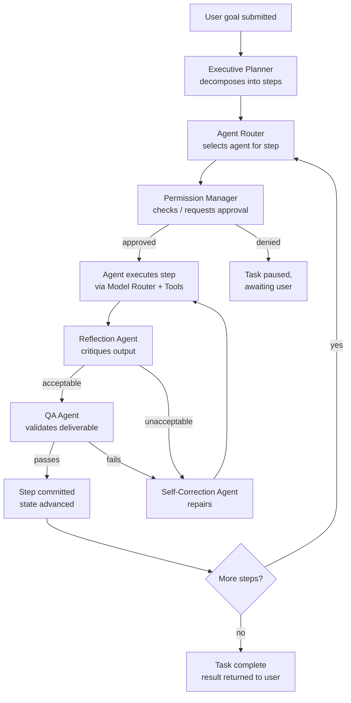
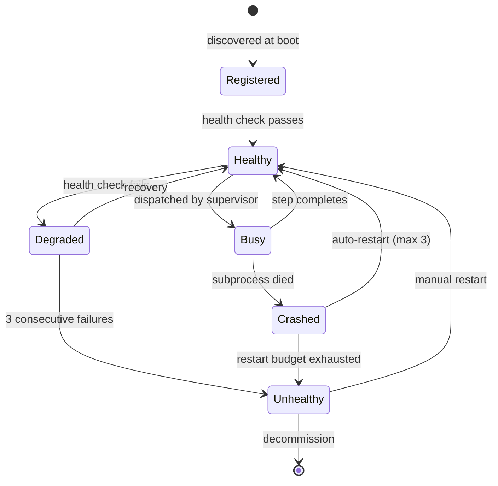
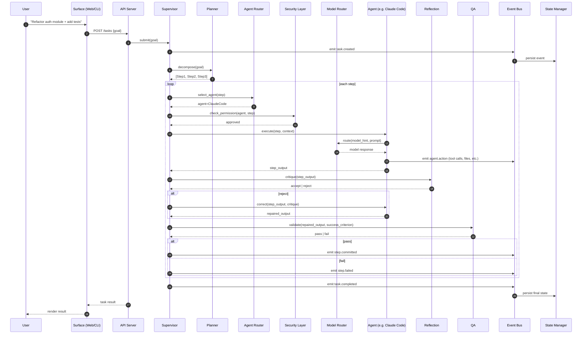

# 02 — System Design

> **Audience:** implementers.
> **Purpose:** define the kernel, the supervisor loop, the agent lifecycle, and the end-to-end request flow. Every component named here has a full entry in [`03-component-map.md`](03-component-map.md).

---

## 1. The five layers

The system is organized as five concentric layers. Dependencies flow strictly inward (L5 → L1). An inner layer never imports an outer layer; this is enforced in CI.

### L1 — Kernel
The kernel is the irreducible core. It contains the Event Bus, the State Manager, the Configuration Manager, the Logging System, the Telemetry collector, the Dependency Injection container, and the two registries (Tool Registry and Prompt Registry). The kernel has zero knowledge of agents, models, or user interfaces. It only knows about *events*, *state*, *config*, *logging*, and *typed registries*. A different product (say, an IoT orchestration platform) could reuse the kernel verbatim.

### L2 — Services
Services are the horizontal capabilities that the supervisor and agents depend on: Model Router, Memory Manager, Vector Memory, Knowledge Graph, MCP Manager, Plugin Manager, Security Layer, and Permission Manager. Services depend only on the kernel. Services do not know about each other except through kernel-mediated events.

### L3 — Agents
Agents are the executors. Each agent has a single specialty: Claude Code (software engineering), Hermes (desktop automation), Research (web research), Browser (web interaction), Memory (memory operations), QA (quality assurance), Reflection (self-critique), Self-Correction (repair), and Planner (decomposition). Agents depend on services (for memory, models, tools) and on the kernel (for events, state). Agents never call each other directly; they always go through the supervisor.

### L4 — Supervision
The supervision layer is where autonomy is governed. The Supervisor Agent owns the task lifecycle. The Executive Planner decomposes goals. The Agent Router dispatches to the right agent. The Reflection Agent critiques outputs. The Self-Correction Agent repairs failures. The QA Agent validates deliverables. The Workflow Engine runs multi-step workflows. This layer depends on L1, L2, and L3, but no agent (L3) depends on a supervisor (L4).

### L5 — Surfaces
Surfaces are how the outside world reaches the system: CLI, Web UI, Desktop App, REST/gRPC API. Surfaces depend on L4 (to submit goals) and L2 (to read observability data). They never bypass L4 to talk to an agent directly.

## 2. The kernel

### 2.1 Event Bus
The Event Bus is an in-process async pub/sub bus with optional Redis pub/sub adapter for multi-process deployments. Every event has a typed Pydantic schema, a monotonic sequence number, a timestamp, a correlation ID (the task that caused it), and a causation ID (the event that triggered it). Events are persisted to the Event Store (a Postgres table or a SQLite file) *before* any subscriber is allowed to observe a side effect — this is INV-04.

```python
class Event(BaseModel):
    id: UUID
    sequence: int                  # monotonic per-stream
    timestamp: datetime
    correlation_id: UUID           # the task
    causation_id: UUID | None      # the event that caused this one
    topic: str                     # e.g. "agent.dispatched"
    payload: dict[str, Any]        # validated against topic schema
    actor: ActorRef                # who emitted
```

Subscribers register against topics with a typed handler. The bus guarantees at-least-once delivery within a process; idempotency is the subscriber's responsibility. For cross-process scenarios, the Redis adapter provides at-least-once delivery with redelivery after a configurable ack timeout.

### 2.2 State Manager
The State Manager is event-sourced. The current state is a pure fold over the event log. State is partitioned by aggregate root (Task, Agent, Workflow, MemoryScope, Plugin). Each aggregate has a reducer that takes `(current_state, event) -> new_state`. This design gives us:

- **Free replay** — any past state is reconstructable by replaying the log.
- **Free audit** — the log *is* the audit trail.
- **Free time-travel debugging** — the dashboard can scrub through task history.
- **Trivial disaster recovery** — replay the log from a snapshot + WAL.

Snapshots are taken every N events per aggregate to bound replay cost. The snapshot format is versioned; a snapshot migration runs on boot if needed.

### 2.3 Configuration Manager
Configuration is loaded from (in priority order): CLI flags, environment variables, `.env` file, `config.yaml`, built-in defaults. Every config key has a schema, a default, and a doc string. Configuration can be hot-reloaded: changes emit a `config.changed` event, and subscribers (e.g., the Model Router) react accordingly. Secrets are never stored in config files — they live in the Secret Manager (part of L2 Security).

### 2.4 Logging System
Logging is structured JSON, emitted to stdout (for containers) and to a rotating file (for desktop). Every log entry has a correlation ID, a causation ID, a level, a message, and a structured payload. Logs and events share the same ID space, so a log entry can be cross-referenced to an event and vice versa.

### 2.5 Telemetry
Telemetry is OpenTelemetry-compatible: traces, metrics, and logs are all exported via OTLP. The system ships with a default in-process exporter (visible on the dashboard) and optional OTLP/gRPC exporter for external backends (Jaeger, Tempo, Honeycomb, Datadog). Telemetry is opt-out, never opt-in — the system is observable by default.

### 2.6 Dependency Injection container
A single `Container` is constructed at boot. It owns all service instances and injects them into agents and supervisors. The container is typed (mypy-checked) — if a component depends on something that is not registered, the system fails to boot. This is the enforcement mechanism for INV-01 (no inner layer instantiating an outer layer's class).

### 2.7 Tool Registry
A tool is a typed, permission-gated function that an agent can call. The Tool Registry is the single source of truth for tools: built-in tools (filesystem, shell, http), MCP-provided tools, and plugin-provided tools all register here. Each tool has a JSON schema (for the LLM tool-calling interface), a Python signature (for direct invocation), and a permission requirement (for the security layer).

### 2.8 Prompt Registry
Prompts are versioned, templated, and stored in the Prompt Registry. A prompt has a name, a version, a Jinja2 template, a list of input variables, and a list of allowed output formats. The supervisor and agents never construct prompts by string concatenation — they always go through the Prompt Registry. This makes prompts diffable, reviewable, and A/B-testable.

## 3. The supervisor loop

The supervisor is the heart of the system. It runs a continuous loop over every active task.



### 3.1 Executive Planner
Takes a natural-language goal and produces a plan: an ordered list of steps, each with a goal, an expected agent, a success criterion, and a rollback hint. The planner is allowed to revise the plan mid-execution if reflection or QA signals that the plan is wrong. The planner is *not* allowed to take actions itself; it only emits plans.

### 3.2 Agent Router
Given a step, selects the best agent for it. The router uses a combination of declared agent capabilities (each agent publishes a capability manifest), recent agent performance (track record stored in memory), and current agent load. The router's decisions are logged and can be overridden by the user from the dashboard.

### 3.3 Reflection Agent
After every agent execution, the Reflection Agent inspects the output and asks: "Did this step actually move us toward the goal? Did it violate any constraint? Is the output internally consistent?" Reflection is itself an LLM call (routed through the Model Router), but with a smaller, cheaper model by default. Reflection outputs a verdict (`accept` / `reject` / `needs_correction`) and a critique.

### 3.4 Self-Correction Agent
When reflection returns `reject` or `needs_correction`, the Self-Correction Agent generates a repaired input or repaired execution plan for the failing agent. It uses the critique, the original input, and the original output. It is rate-limited per step (default: 3 correction attempts) — after which the task is paused and the user is notified.

### 3.5 QA Agent
QA is the final gate before a step's output is committed. QA checks the deliverable against the step's success criterion. QA is deterministic where possible (lint, tests, schema validation) and LLM-based where necessary (semantic correctness, tone, completeness). A step is only committed when QA passes.

### 3.6 Workflow Engine
For tasks that the user has encoded as workflows (saved, reusable plans), the Workflow Engine bypasses the Executive Planner and executes the workflow directly — but still goes through the Agent Router, Reflection, Self-Correction, and QA. Workflows are versioned and stored in Postgres.

## 4. Agent lifecycle

Every agent — whether built-in or plugin-provided — follows the same lifecycle:



Agents are discovered at boot via Python entry points (built-in) or the plugin manifest (plugin-provided). Each agent publishes:
- A **capability manifest** — what kinds of steps it can handle.
- A **health check** — `healthy` / `degraded` / `unhealthy`.
- A **track record** — recent success rate, latency, cost (stored in memory).
- A **permission profile** — what it is allowed to do by default.

## 5. End-to-end request flow

A user submits a goal from any surface (CLI, web, desktop, API). The flow is:



Every numbered arrow is an event on the bus and a row in the audit log. The user can pause the task at any step, inspect the supervisor's reasoning, override the agent router's choice, or roll back to a previous step.

## 6. Concurrency model

The supervisor runs as a single asyncio event loop. Within it:

- **Tasks** are independent coroutines — multiple user tasks can run concurrently, each with its own supervisor state machine.
- **Steps within a task** are sequential by default (the plan is ordered), but the planner can declare steps as parallelizable; in that case they run as concurrent coroutines with a `asyncio.gather`.
- **Agent subprocesses** run in their own OS processes; the supervisor communicates with them over async JSON-RPC. A subprocess crash does not crash the supervisor.
- **CPU-bound work** (embeddings, knowledge-graph reasoning, large JSON parsing) is offloaded to a `ProcessPoolExecutor` to avoid blocking the loop.
- **External I/O** (LLM calls, MCP servers, database) is async; no `requests`, no `time.sleep`, no synchronous file I/O on the main loop.

The system is designed to saturate a single machine well before it needs to scale horizontally. Horizontal scaling (multiple supervisor processes coordinating over Redis) is a v1.1 goal.

## 7. Failure model

Failures are classified into four buckets, each with a defined handling strategy:

| Failure class | Example | Strategy |
|---------------|---------|----------|
| Transient | LLM 429, network blip, MCP server restart | Retry with exponential backoff (max 3), then failover to alternate provider/agent |
| Logical | Agent produced wrong output, tool returned error | Self-Correction Agent (max 3 attempts), then pause and notify user |
| Resource | Out of memory, disk full, subprocess crash | Restart the affected component; if it fails 3× in 5 min, mark unhealthy and reroute |
| Catastrophic | Kernel panic, supervisor crash | Restart the supervisor; replay event log to recover state; resume tasks from last committed step |

No failure is allowed to leave the system in an inconsistent state. The state manager's event-sourced design guarantees that a crash at any point leaves either the pre-step state or the post-step state, never a half-committed state.

## 8. Extensibility points

The system exposes four first-class extension points. Everything else is implementation detail.

1. **Provider plugin** — implement the `ModelProvider` protocol; the Model Router picks it up automatically.
2. **Agent plugin** — implement the `Agent` protocol; the Agent Router considers it for dispatch.
3. **Tool plugin** — register one or more tools with the Tool Registry; any agent can call them.
4. **Memory adapter plugin** — implement the `MemoryStore` protocol; swap Qdrant for Weaviate or Chroma without touching the supervisor.

Each extension point has a full SDK (Phase 9) with typed interfaces, examples, and a test harness.
