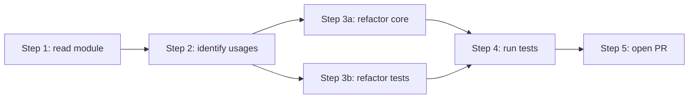
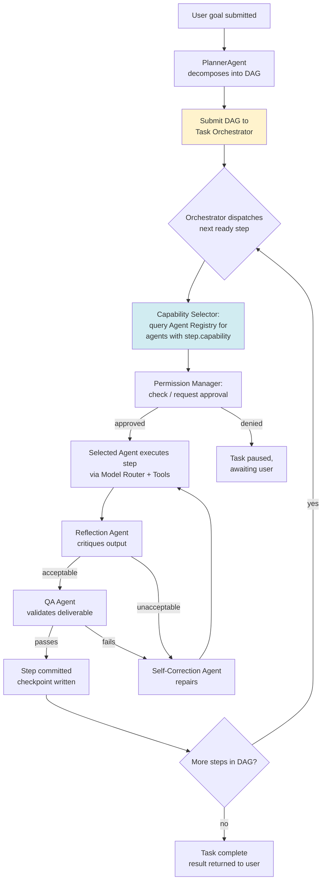
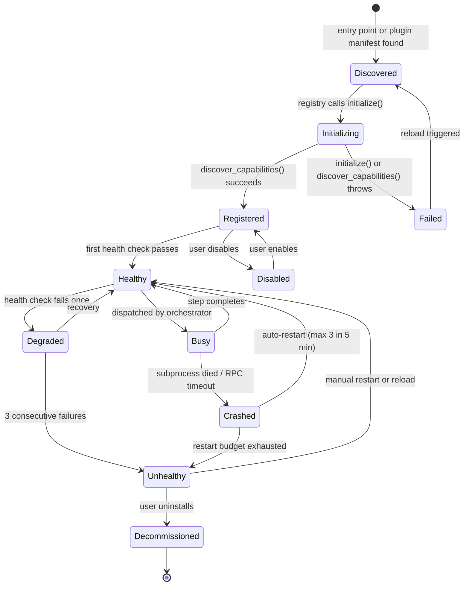
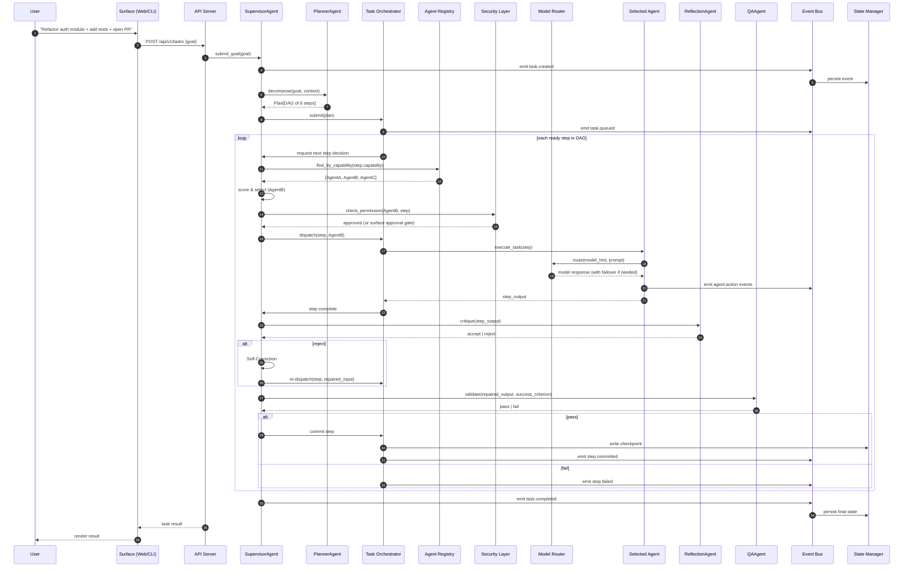

# 03 — System Design

> **Audience:** implementers.
> **Purpose:** define the kernel, the Task Orchestrator, the supervisor-as-agent model, the agent lifecycle, and the end-to-end request flow. Every component named here has a full entry in [`04-component-map.md`](04-component-map.md).

---

## 1. The five layers

The system is organized as five concentric layers. Dependencies flow strictly inward (L5 → L1). An inner layer never imports an outer layer; this is enforced in CI.

### L1 — Kernel
The kernel is the irreducible core: Event Bus, State Manager, Configuration Manager, Logging System, Telemetry collector, DI container, Tool Registry, Prompt Registry, and the **Gateway** (the only package allowed to perform I/O — filesystem, network, shell, subprocess). The kernel has zero knowledge of agents, models, or user interfaces. A different product could reuse the kernel verbatim.

### L2 — Services
Horizontal capabilities that agents and the supervisor depend on: **Model Router** (agents never call providers directly — all LLM access goes through the router), **Memory Manager** (vector + graph + relational), **MCP Manager**, **Plugin Manager**, **Security Layer** (RBAC + secrets + sandboxing + audit), **Permission Manager**, and the **Agent Registry** (the single source of truth for "which agents exist and what can they do"). Services depend only on the kernel. Services do not know about each other except through kernel-mediated events.

### L3 — Agents
Implementations of the `GenericAgent` interface (see [`02-generic-agent-runtime.md`](02-generic-agent-runtime.md)). Every agent — Supervisor, Planner, Coding (Claude Code, OpenHands, …), Desktop (Hermes, …), Research, Browser, Memory, Reflection, QA, Security, Deployment, Vision, Voice, Document, Workflow, Custom — lives here. Agents depend on services (for models, memory, tools) and on the kernel (for events, state). Agents never call each other directly; they always go through the Supervisor or the Task Orchestrator.

### L4 — Supervision & Orchestration
This layer contains two peers:
- **SupervisorAgent** — owns the task lifecycle and decision-making. Decomposes goals (via a PlannerAgent), selects agents (via the Agent Registry), invokes Reflection/Self-Correction/QA, commits steps.
- **Task Orchestrator** — owns the execution infrastructure: task queue, priority queue, dependency DAG, parallel execution, retry policies, checkpointing, resume, cancellation, scheduling, background workers, human approval gates.

The Supervisor decides *what* to do; the Orchestrator handles *how* to execute it reliably. Both live in L4. The Supervisor depends on the Orchestrator; the Orchestrator does not depend on the Supervisor (it executes whatever the Supervisor — or any other L4 caller — submits).

### L5 — Surfaces
How the outside world reaches the system: CLI, Web UI, Desktop App, REST/gRPC API. Surfaces depend on L4 (to submit goals) and L2 (to read observability data). They never bypass L4 to talk to an agent directly.

## 2. The kernel

### 2.1 Event Bus
In-process async pub/sub with optional Redis adapter for multi-process. Every event has a typed Pydantic schema, a monotonic sequence number, a timestamp, a correlation ID (the task), and a causation ID (the event that triggered it). Events are persisted to the Event Store *before* any subscriber observes a side effect (INV-04).

### 2.2 State Manager
Event-sourced. Current state is a pure fold over the event log. State is partitioned by aggregate root (`Task`, `Agent`, `Workflow`, `MemoryScope`, `Plugin`, `User`, `ApprovalGate`). Each aggregate has a reducer `(state, event) -> state`. Snapshots are taken every N events per aggregate to bound replay cost. This design gives free replay, free audit, free time-travel debugging, and trivial disaster recovery.

### 2.3 Configuration Manager
Layered loader: CLI flags > environment variables > `.env` file > `config.yaml` > built-in defaults. Every key has a schema, a default, and a doc string. Hot-reloadable — changes emit `config.changed`. Secrets are never in config files; they live in the Secret Store and are referenced via `${secret:name}` placeholders resolved at access time (never cached).

### 2.4 Logging System
Structured JSON via structlog. Every entry has correlation ID, causation ID, level, message, structured payload. Logs and events share the same ID space for cross-referencing.

### 2.5 Telemetry
OpenTelemetry SDK wired throughout. Traces, metrics, logs all exported via OTLP (in-process exporter for the dashboard; OTLP/gRPC exporter for external backends). Telemetry is opt-out, never opt-in.

### 2.6 Dependency Injection container
Single `Container` constructed at boot. Typed (mypy-checked). If a component depends on something unregistered, the system fails to boot. This is the enforcement mechanism for INV-01.

### 2.7 Tool Registry
Single source of truth for tools (built-in, MCP-provided, plugin-provided). Each tool has: JSON schema (for LLM tool-calling), Python signature (for direct invocation), permission requirement (for the Security Layer). Tools are how agents affect the world; every tool call is mediated.

### 2.8 Prompt Registry
Versioned, templated prompts (Jinja2). A prompt has a name, version, template, input variables, allowed output formats. The Supervisor and agents never construct prompts by string concatenation — they always go through the Prompt Registry. This makes prompts diffable, reviewable, and A/B-testable.

### 2.9 Gateway
The **only** package in the entire codebase allowed to import `subprocess`, `os.open`, `socket`, `httpx`, `requests`. Enforced by ruff custom rule (INV-02). Provides:
- `gateway.fs.read(path) / write(path, content) / list(dir) / delete(path)` — filesystem, scoped by sandbox
- `gateway.shell.exec(cmd, sandbox)` — shell execution, sandboxed
- `gateway.net.request(method, url, body)` — HTTP/HTTPS, egress-allow-listed
- `gateway.process.spawn(name, args)` — subprocess, sandboxed
- `gateway.desktop.input(...)` — keyboard/mouse, only available to DesktopAgents with permission
- `gateway.clipboard.read() / write(text)` — clipboard, permission-gated

Every gateway call is permission-checked, audit-logged, and rate-limited. Agents call `gateway.fs.read(...)` not `open(...)` — there is no `open` in their namespace (the plugin sandbox enforces this; see `07-security-model.md`).

## 3. The Task Orchestrator

The Task Orchestrator is the execution infrastructure. It is distinct from the Supervisor: the Supervisor makes decisions; the Orchestrator makes execution reliable. Any L4 caller (Supervisor, Workflow Agent, external API caller) can submit a plan to the Orchestrator.

### 3.1 Task Queue & Priority Queue
- Tasks enter a priority queue (5 levels: `critical` > `high` > `normal` > `low` > `background`).
- Within a level, FIFO. Across levels, strict priority with **aging** (a task that has waited >N seconds in a low level gets promoted) to prevent starvation.
- Concurrency limit per priority level (configurable; default: `critical=4, high=4, normal=8, low=4, background=2`).
- Queue depth and wait time are exported as metrics.

### 3.2 Workflow Engine
Executes saved, reusable workflows. A workflow is a versioned JSON document describing a DAG of steps. The Workflow Engine:
- Parses the workflow definition (validated against a schema at save time).
- Submits the DAG to the Orchestrator's executor.
- Tracks per-step state (pending, running, succeeded, failed, skipped, retrying).
- Emits workflow events for the dashboard.
- Supports workflow variables (inputs, outputs, intermediate values).

### 3.3 Parallel Execution & Dependency Graph
Steps within a task form a DAG (not just a list). The Planner declares dependencies; the Orchestrator executes independent steps concurrently via `asyncio.gather`, respecting the per-priority concurrency limits. The DAG is validated at submission time (no cycles, no missing dependencies, no unreachable steps).



### 3.4 Retry Policies
Per-step retry policy:
```python
class RetryPolicy(BaseModel):
    max_attempts: int = 3
    backoff: Literal["constant", "linear", "exponential"] = "exponential"
    initial_delay_s: float = 1.0
    max_delay_s: float = 60.0
    retryable_errors: list[str] = ["transient", "timeout", "rate_limit"]
    non_retryable_errors: list[str] = ["permission_denied", "validation_error"]
```

Retries are logged with the attempt number and the error. After `max_attempts`, the step fails and the Orchestrator consults the Supervisor for the next move (Self-Correction, replan, or pause).

### 3.5 Checkpointing
Every committed step is a checkpoint. The Orchestrator writes the checkpoint to the State Manager *before* acknowledging the step to the Supervisor. A checkpoint contains:
- The step ID and status.
- The agent that executed it and the capability used.
- The input, output, and reflection verdict.
- The state snapshots of all participating agents (via `serialize_state`).
- The cost incurred so far.

If the system crashes, the Orchestrator on reboot loads the latest checkpoint per task and offers the Supervisor three options: resume, rollback to a prior checkpoint, or abort.

### 3.6 Resume
Resume reconstructs the task state from checkpoints:
1. Load the latest checkpoint.
2. For each participating agent, call `restore_state(snapshot)`.
3. Re-evaluate the DAG — completed steps are skipped, in-flight steps are restarted (agents are stateless across crashes; their in-memory state was lost).
4. Continue execution from the next pending step.

### 3.7 Cancellation
- **User-initiated:** the user clicks "Cancel" on the dashboard → Supervisor calls `Orchestrator.cancel(task_id)` → Orchestrator calls `agent.cancel_task(task_id)` on every running step → agents cooperatively cancel → final state is `cancelled` with a record of what was completed.
- **System-initiated:** timeout, resource exhaustion, parent task cancelled. Same flow.
- **Cascade:** cancelling a parent task cancels all child tasks (DAG descendants) first, then the parent.

### 3.8 Scheduling
The Orchestrator has a built-in scheduler for recurring and delayed tasks:
- **Cron-like:** `cron="0 9 * * 1-5"` (every weekday at 9am). Backed by Windows Task Scheduler on Windows, in-process APScheduler on Linux (Phase 1.1).
- **Delayed:** `run_at=2026-07-15T14:00:00Z`.
- **Recurring:** `every="1h"`.

Scheduled tasks are persisted (survive reboot) and visible on the dashboard.

### 3.9 Background Workers
Long-running or CPU-bound tasks (embeddings, large file processing, batch jobs) run in a separate worker pool. The Orchestrator exposes `submit_background(work)` which returns immediately with a job ID; the dashboard polls or subscribes via WebSocket for completion. Workers can be on the same machine (default) or on a separate worker host (Phase 1.1).

### 3.10 Human Approval Gates
Any step can declare an approval gate:
```python
class ApprovalGate(BaseModel):
    gate_type: Literal["pre_step", "post_step", "pre_commit"]
    required_role: Literal["owner", "admin", "operator"] = "operator"
    timeout_s: int = 300  # 5 min default
    on_timeout: Literal["pause", "deny"] = "pause"
    message: str  # shown to the user
```

When the Orchestrator reaches a gate, it emits `approval.requested`, the Permission Manager surfaces it to the user (dashboard + CLI + optional Slack/email), and execution pauses until the user responds. If `on_timeout=pause`, the task is paused and the user is notified; if `on_timeout=deny`, the step fails.

## 4. The supervisor loop

The SupervisorAgent runs a continuous loop over every active task. The Supervisor itself is a `GenericAgent` (see `02-generic-agent-runtime.md` §3.1) — it can be replaced with an alternative implementation that uses a different planning or reflection strategy.



### 4.1 PlannerAgent
Takes a natural-language goal and produces a Plan (a DAG of steps, each with a goal, a capability requirement, a success criterion, a rollback hint, dependencies, and an optional approval gate). The Planner can revise the plan mid-execution if reflection or QA signals that the plan is wrong. The Planner is *not* allowed to take actions itself; it only emits plans.

### 4.2 Capability Selector (replaces "Agent Router")
Given a step with a capability requirement, queries the Agent Registry for healthy agents that advertise that capability, scores them (track record 40%, load 20%, cost 20%, latency 15%, user preference 5%), and picks the best. The selection reasoning is logged and can be overridden by the user. See `02-generic-agent-runtime.md` §5.

### 4.3 ReflectionAgent
After every agent execution, inspects the output and asks: "Did this step move us toward the goal? Did it violate any constraint? Is the output internally consistent?" Reflection is an LLM call routed through the Model Router, with a smaller/cheaper model by default. Outputs a verdict (`accept` / `reject` / `needs_correction`) and a critique.

### 4.4 Self-Correction Agent
When reflection returns `reject` or `needs_correction`, generates a repaired input or repaired execution plan for the failing agent. Uses the critique, the original input, and the original output. Rate-limited per step (default 3 attempts) — after which the task is paused and the user is notified.

### 4.5 QAAgent
Final gate before a step's output is committed. Checks the deliverable against the step's success criterion. Deterministic where possible (lint, tests, schema validation), LLM-based where necessary (semantic correctness, tone, completeness). A step is only committed when QA passes.

### 4.6 Workflow Engine (under Orchestrator)
For saved workflows, the Workflow Engine bypasses the PlannerAgent and submits the workflow's DAG directly to the Orchestrator — but the same Reflection / Self-Correction / QA gates apply.

## 5. Agent lifecycle

Every agent follows the same lifecycle (managed by the Agent Registry):



The lifecycle is implementation-agnostic: in-process agents and subprocess-bridge agents follow the same states. The Registry abstracts the difference.

## 6. End-to-end request flow



Every numbered arrow is an event on the bus and a row in the audit log. The user can pause the task at any step, inspect the Supervisor's reasoning, override the Capability Selector's choice, or roll back to a prior checkpoint.

## 7. Concurrency model

- **Single asyncio event loop** in the Supervisor process. Multiple user tasks run concurrently as coroutines, each with its own state machine.
- **Steps within a task** execute per the DAG — independent steps run concurrently (`asyncio.gather`), dependent steps wait.
- **Agent subprocesses** (Claude Code, Hermes, future agents) run in their own OS processes; the Supervisor communicates via async JSON-RPC. A subprocess crash does not crash the Supervisor.
- **CPU-bound work** (embeddings, knowledge-graph reasoning, large JSON parsing) is offloaded to a `ProcessPoolExecutor` to avoid blocking the loop.
- **External I/O** (LLM calls, MCP, DB) is async. No `requests`, no `time.sleep`, no sync file I/O on the main loop. The Gateway enforces this for in-process agents; subprocess agents manage their own I/O internally.

The system is designed to saturate a single Windows machine well before needing horizontal scale. Multi-machine deployment (multiple Supervisor processes coordinating over a shared Postgres + Redis) is a v1.1 goal.

## 8. Failure model

| Failure class | Example | Strategy |
|---------------|---------|----------|
| Transient | LLM 429, network blip, MCP restart | Orchestrator's retry policy (exponential backoff, max 3) → Model Router failover to alternate provider |
| Logical | Agent produced wrong output, tool returned error | Self-Correction (max 3 attempts) → pause and notify user |
| Resource | Out of memory, disk full, subprocess crash | Restart affected component; 3 failures in 5 min → mark unhealthy, reroute to alternate agent (if available) |
| Catastrophic | Kernel panic, Supervisor crash | Process manager (Windows Service / NSSM) restarts the Supervisor; replay event log; resume tasks from last checkpoint |

No failure leaves the system in an inconsistent state. The state manager's event-sourced design + the Orchestrator's checkpointing guarantee that a crash at any point leaves either the pre-step or post-step state, never a half-committed state.

## 9. Extensibility points

Five first-class extension points. Everything else is implementation detail.

1. **Provider plugin** — implement the `ModelProvider` protocol; the Model Router picks it up automatically.
2. **Agent plugin** — implement `GenericAgent` (or a type-specific sub-protocol like `CodingAgent`); register with the Agent Registry; the Capability Selector considers it for dispatch automatically.
3. **Tool plugin** — register one or more tools with the Tool Registry; any agent can call them.
4. **Memory adapter plugin** — implement the `MemoryStore` protocol; swap Qdrant for Weaviate or Chroma without touching the Supervisor.
5. **Surface plugin** — implement a new surface (e.g., a Slack bot, a Teams tab); register with the Surface Registry.

Each extension point has a full SDK with typed interfaces, examples, and a test harness. See `09-roadmap.md` Phase 9.

## 10. Windows-first implications

The system is designed for Windows 11 first. Concrete consequences for the system design:

- **Subprocess binding** uses Windows CreateProcess with job-object-level resource limits and child-process grouping (so cancelling a Hermes task kills its child browser processes too).
- **Sandboxing** uses Windows Job Objects + AppContainer + Windows Defender Application Control (WDAC) policies. No seccomp, no bubblewrap. See `07-security-model.md`.
- **File paths** are Windows-style (`C:\Users\…`, `%APPDATA%\AAiOS\`). The Gateway abstracts path normalization; agents see OS-native paths.
- **Shell** is PowerShell 7+ (preferred) or cmd.exe. The Gateway's `shell.exec` accepts a `shell` parameter; the Supervisor selects based on the agent's declared preference.
- **Scheduling** delegates to Windows Task Scheduler (via `schtasks` or the COM API) for persistence across reboots.
- **Background workers** run as a Windows Service (via NSSM or `pywin32`).
- **No fork()** — Windows lacks `fork()`. Subprocess agents are spawned via `CreateProcess` with stdin/stdout pipes for JSON-RPC. In-process agents use `multiprocessing` with spawn semantics (the default on Windows, opt-in on Linux).
- **Linux compatibility** is an abstraction-layer concern: the Gateway, the Scheduler, and the Service Manager have Windows and Linux adapters. Only the adapters are platform-specific; the core is platform-neutral. Linux adapters are stubbed in v1 and completed in v1.1.

For the full Windows-first deployment story, see `08-deployment-topology.md`.

This concludes the system design. For the full component inventory, see [`04-component-map.md`](04-component-map.md).
