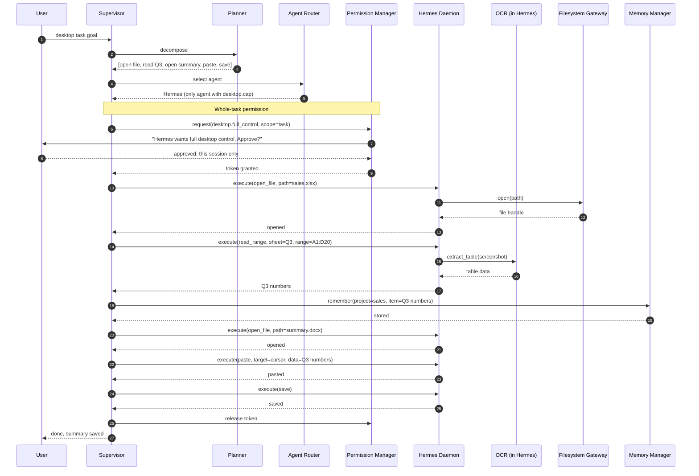
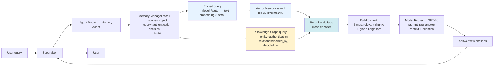
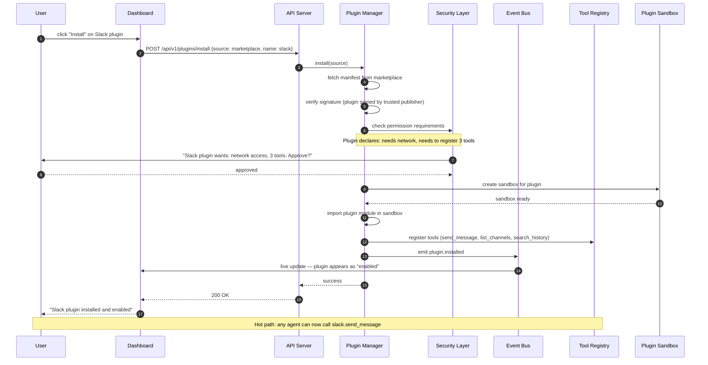

# 04 — Data Flow

> **Audience:** implementers and reviewers.
> **Purpose:** show the end-to-end data flow for four representative scenarios. These are the "integration stories" that every component must satisfy.

---

## Scenario 1 — Autonomous coding task

**User goal:** *"Refactor the `auth/` module to use Pydantic v2, add tests, and open a PR."*

```mermaid
flowchart TD
    G[Goal submitted via Web UI] --> SUB[Supervisor receives task]
    SUB --> PLAN[Executive Planner decomposes:
        1. Read current auth module
        2. Identify Pydantic v1 usages
        3. Refactor to v2
        4. Write tests
        5. Run tests
        6. Open PR]
    PLAN --> S1[Step 1: read module]
    S1 --> AR1[Agent Router → Claude Code]
    AR1 --> SEC1[Security: project-scope fs read ✓]
    SEC1 --> CC1[Claude Code executes
        via subprocess + JSON-RPC]
    CC1 --> REF1[Reflection: output
        is complete and accurate ✓]
    REF1 --> QA1[QA: schema check on
        file inventory ✓]
    QA1 --> S2[Step 2: identify usages]
    S2 --> AR2[Agent Router → Claude Code]
    AR2 --> CC2[Claude Code executes
        Model Router → Anthropic Sonnet]
    CC2 --> REF2[Reflection ✓]
    REF2 --> QA2[QA ✓]
    QA2 --> S3[Step 3: refactor]
    S3 --> AR3[Agent Router → Claude Code]
    AR3 --> SEC3[Security: project-scope fs write
        Permission Manager: ask user once
        for write scope]
    SEC3 -->|approved| CC3[Claude Code writes files]
    CC3 --> REF3[Reflection ✓]
    REF3 --> QA3[QA: run ruff + mypy ✓]
    QA3 --> S4[Step 4: write tests]
    S4 --> AR4[Agent Router → Claude Code]
    AR4 --> CC4[Claude Code writes tests
        Model Router → routed to cheaper
        Haiku for boilerplate]
    CC4 --> REF4[Reflection ✓]
    REF4 --> QA4[QA: pytest collection ✓]
    QA4 --> S5[Step 5: run tests]
    S5 --> AR5[Agent Router → Claude Code]
    AR5 --> CC5[Claude Code runs pytest
        in sandboxed shell]
    CC5 --> REF5[Reflection: 2 tests fail ✗]
    REF5 --> CORR[Self-Correction Agent
        generates repair plan]
    CORR --> CC5b[Claude Code repairs
        test fixtures]
    CC5b --> REF5b[Reflection ✓]
    REF5b --> QA5[QA: pytest passes ✓]
    QA5 --> S6[Step 6: open PR]
    S6 --> AR6[Agent Router → Claude Code]
    AR6 --> SEC6[Security: git push + GitHub API
        Permission Manager: ask user
        for push scope]
    SEC6 -->|approved| CC6[Claude Code:
        git push + gh pr create]
    CC6 --> REF6[Reflection ✓]
    REF6 --> QA6[QA: PR URL returned ✓]
    QA6 --> DONE[Task complete,
        PR URL returned to user]

    style SEC3 fill:#fff3cd
    style SEC6 fill:#fff3cd
    style REF5 fill:#f8d7da
    style CORR fill:#d1ecf1
```

**Key observations:**
- Every step goes through Reflection + QA. Step 5 fails reflection (tests fail), triggers Self-Correction, retries.
- Two steps (Step 3, Step 6) require interactive permission Manager approval for filesystem write and git push.
- Model Router can downgrade to cheaper models for boilerplate (test generation) — the user can override this from the dashboard.
- The full sequence is reconstructable from the audit log alone (INV-06).

---

## Scenario 2 — Desktop automation task

**User goal:** *"Open the sales report spreadsheet, copy the Q3 numbers, and paste them into the monthly summary doc."*

**Key observations:**
- Desktop tasks require a higher-trust permission scope. The Permission Manager asks once at task start, not per-action (otherwise the user would be spammed with prompts). The user can still revoke mid-task from the dashboard.
- Hermes communicates with the supervisor over JSON-RPC. Each `execute(...)` call is a single RPC. Hermes is stateful within a task (it remembers open windows).
- The supervisor remembers the extracted Q3 numbers in project memory, so if the paste fails, the data is not lost — the supervisor can retry without re-reading the spreadsheet.

---

## Scenario 3 — RAG query

**User goal:** *"What did we decide about the authentication approach last quarter?"*

**Key observations:**
- Memory recall is hybrid: vector similarity (Qdrant) + graph traversal (Knowledge Graph). The graph catches decisions that may not be textually similar to the query but are topologically connected.
- The rerank step uses a cross-encoder (small, fast) to merge and dedupe results from both sources.
- The final answer is generated with explicit citations back to the source memory items, so the user can verify.
- If the user asks a follow-up ("and who was in that meeting?"), the conversation memory carries the prior context, and the graph can be traversed from the `authentication` node to its `meeting` neighbors.

---

## Scenario 4 — Plugin install

**User goal:** *"Install the Slack plugin from the marketplace."*

**Key observations:**
- Plugins are signed. The marketplace verifies the publisher's signature before the plugin is even offered for installation. Self-hosted plugins can be unsigned but require explicit user opt-in.
- Plugin permissions are declared in the manifest and approved at install time. A plugin that tries to do something undeclared at runtime is blocked by the sandbox.
- The plugin runs in a sandboxed Python interpreter (restricted `__builtins__`, no direct filesystem or network access — those go through the Security Layer like everything else).
- Installation is hot — no runtime restart. Any agent can call the new tool immediately. Uninstall is also hot; in-flight tool calls are allowed to finish.

---

## Cross-cutting data flow patterns

Across all four scenarios, the following patterns are invariant:

### Pattern A: Every action is event-sourced
Before any side effect is observed by an external system (file written, network request sent, message posted), the corresponding event is persisted to the event store. This is INV-04. If the system crashes between the event persist and the side effect, replay will re-execute the side effect (idempotency required of the tool). If the system crashes after the side effect but before the "completed" event, replay will detect the side effect already happened (via the tool's idempotency key) and skip.

### Pattern B: Every decision is observable
Every supervisor decision (which agent, which model, which tool, which approval scope) is emitted as an event with the full reasoning trace. The dashboard can show the user *why* the supervisor chose Claude Code over Hermes, or *why* it routed to Haiku instead of Sonnet.

### Pattern C: Every external call is permission-gated
No code outside the `core/gateway/` package is allowed to import `subprocess`, `open`, `requests`, `httpx`, or `socket`. CI enforces this with a static-analysis rule. The gateway is the only path to the outside world, and every gateway call goes through the Security Layer.

### Pattern D: Every memory access is scoped
Memory is partitioned by scope (short-term, long-term, conversation, project, semantic). Agents only see the scopes they are granted. An agent that is handling a coding task for project A cannot read the conversation memory of project B. This prevents accidental data leakage across projects and across users in multi-user deployments.

### Pattern E: Every failure is recoverable
No failure leaves the system in an unrecoverable state. The state is always either pre-step or post-step, never mid-step. This is guaranteed by the event-sourced state manager and by the idempotency requirement on every tool.

This concludes the data flow document. For the concrete technology choices that enable these flows, see [`05-tech-stack.md`](05-tech-stack.md).
