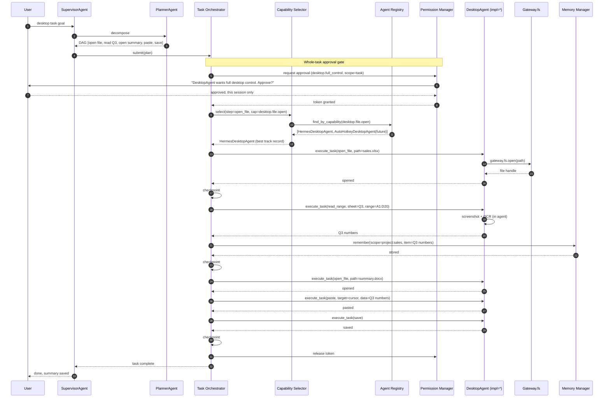
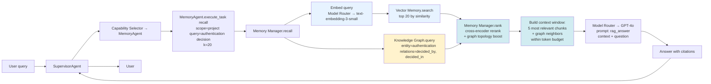
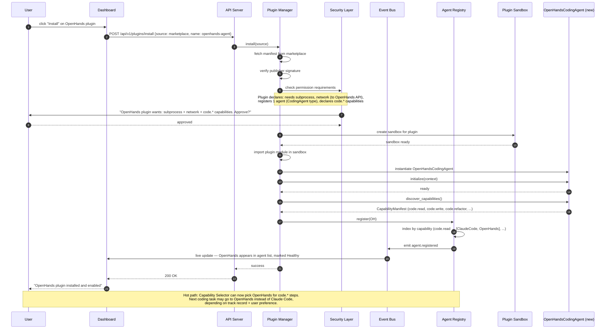

# 05 — Data Flow

> **Audience:** implementers and reviewers.
> **Purpose:** end-to-end data flow for four representative scenarios. **Scenarios are written against agent types (CodingAgent, DesktopAgent, etc.), not product names.** Where a specific implementation is used (Claude Code, Hermes), it is called out as a runtime selection — the same scenario would work with OpenHands or any future implementation swapped in.

---

## Scenario 1 — Autonomous coding task (implementation-agnostic)

**User goal:** *"Refactor the `auth/` module to use Pydantic v2, add tests, and open a PR."*

The Supervisor does not know which coding agent will execute the steps. The Capability Selector picks one based on track record, health, cost, and user preference. In the diagram below, the chosen implementation is shown as `CodingAgent (impl=*)` — the `*` could be Claude Code today, OpenHands tomorrow.

```mermaid
flowchart TD
    G[Goal submitted via Web UI] --> SUB[SupervisorAgent receives task]
    SUB --> PLAN[PlannerAgent decomposes:
        1. read current auth module
        2. identify Pydantic v1 usages
        3. refactor core
        4. refactor tests  (parallel with 3)
        5. run tests
        6. open PR]
    PLAN --> ORCH[Task Orchestrator receives DAG]
    ORCH --> S1[Step 1: read module]
    S1 --> SEL1[Capability Selector:<br/>find_by_capability code.read<br/>→ pick best CodingAgent]
    SEL1 --> SEC1[Security: project-scope fs read ✓]
    SEC1 --> CC1[CodingAgent.execute_task<br/>via Model Router + Gateway.fs]
    CC1 --> REF1[ReflectionAgent critiques ✓]
    REF1 --> QA1[QAAgent: schema check ✓]
    QA1 --> CK1[Orchestrator writes checkpoint]
    CK1 --> S2[Step 2: identify usages]
    S2 --> SEL2[Capability Selector → CodingAgent]
    SEL2 --> CC2[CodingAgent executes<br/>Model Router routes to Anthropic Sonnet]
    CC2 --> REF2[Reflection ✓]
    REF2 --> QA2[QA ✓]
    QA2 --> CK2[Checkpoint]
    CK2 --> S3[Steps 3a + 3b run in parallel]
    S3 --> SEL3[Capability Selector → CodingAgent ×2]
    SEL3 --> SEC3[Security: project-scope fs write<br/>Approval Gate: ask user once<br/>for write scope]
    SEC3 -->|approved| CC3[CodingAgent writes files ×2]
    CC3 --> REF3[Reflection ✓]
    REF3 --> QA3[QA: ruff + mypy ✓]
    QA3 --> CK3[Checkpoint]
    CK3 --> S5[Step 5: run tests]
    S5 --> SEL5[Capability Selector → CodingAgent]
    SEL5 --> CC5[CodingAgent runs pytest<br/>in sandboxed shell via Gateway.shell]
    CC5 --> REF5[Reflection: 2 tests fail ✗]
    REF5 --> CORR[Self-Correction Agent<br/>generates repair plan]
    CORR --> CC5b[CodingAgent repairs fixtures]
    CC5b --> REF5b[Reflection ✓]
    REF5b --> QA5[QA: pytest passes ✓]
    QA5 --> CK5[Checkpoint]
    CK5 --> S6[Step 6: open PR]
    S6 --> SEL6[Capability Selector → CodingAgent]
    SEL6 --> SEC6[Security: git push + GitHub API<br/>Approval Gate: ask user<br/>for push scope]
    SEC6 -->|approved| CC6[CodingAgent: git push + gh pr create]
    CC6 --> REF6[Reflection ✓]
    REF6 --> QA6[QA: PR URL returned ✓]
    QA6 --> CK6[Checkpoint]
    CK6 --> DONE[Task complete,
        PR URL returned to user]

    style SEL1 fill:#d1ecf1
    style SEL2 fill:#d1ecf1
    style SEL3 fill:#d1ecf1
    style SEL5 fill:#d1ecf1
    style SEL6 fill:#d1ecf1
    style SEC3 fill:#fff3cd
    style SEC6 fill:#fff3cd
    style REF5 fill:#f8d7da
    style CORR fill:#d1ecf1
```

**Key observations:**
- The flow is identical regardless of which CodingAgent implementation is selected. Swap Claude Code → OpenHands → Codex CLI: the diagram doesn't change.
- Every step is checkpointed by the Orchestrator. A crash at any point resumes from the last checkpoint.
- Two steps (3 and 6) require interactive approval-gate approval for filesystem write and git push.
- Model Router can downgrade to cheaper models for boilerplate (test generation) — the user can override from the dashboard.
- The full sequence is reconstructable from the audit log alone (INV-06).

**How a future agent would change this flow:**
A user installs the OpenHands plugin. The Agent Registry now has two CodingAgent implementations. The Capability Selector scores both:
- ClaudeCode track record: 98% success, $0.12/task avg, 4.2s avg latency.
- OpenHands track record: 95% success, $0.08/task avg, 5.1s avg latency.

If the user has no preference, the Selector picks ClaudeCode (higher track record weight). If the user pinned `code.*` to OpenHands, the Selector picks OpenHands. The diagram is unchanged.

---

## Scenario 2 — Desktop automation task (implementation-agnostic)

**User goal:** *"Open the sales report spreadsheet, copy the Q3 numbers, and paste them into the monthly summary doc."*



**Key observations:**
- The Capability Selector may have multiple DesktopAgent implementations to choose from (Hermes today; AutoHotkey, pywinauto, OS-native in the future). Selection is based on track record + capability match.
- Desktop tasks require a higher-trust approval scope. The Permission Manager asks once at task start (via an approval gate), not per-action.
- The DesktopAgent communicates with the Supervisor over JSON-RPC. Each `execute_task` is a single RPC. The agent is stateful within a task (remembers open windows).
- The Orchestrator checkpoints after each step. If the supervisor crashes after the paste but before the save, resume re-opens the summary doc and re-applies the paste — the data is not lost because the Q3 numbers were also persisted to project memory.

---

## Scenario 3 — RAG query

**User goal:** *"What did we decide about the authentication approach last quarter?"*



**Key observations:**
- Recall is hybrid: vector similarity (Qdrant) + graph traversal (Knowledge Graph). The graph catches decisions that may not be textually similar to the query but are topologically connected.
- The Memory Manager's **ranking** step (new in this refactor) uses a cross-encoder (small, fast) to merge and dedupe results from both sources, with a topology boost for items connected to high-relevance nodes.
- The **context window** manager (new) assembles the final context within a token budget — high-rank items first, then graph neighbors, then backfill — and tracks the budget so the LLM call doesn't exceed the model's limit.
- The final answer is generated with explicit citations back to the source memory items, so the user can verify.

---

## Scenario 4 — Plugin install (agent plugin)

**User goal:** *"Install the OpenHands coding agent plugin from the marketplace."**

This scenario shows what happens when a user installs a plugin that registers a new agent. The core system does not change; only the Agent Registry gains an entry.



**Key observations:**
- Plugins are signed. The marketplace verifies the publisher's signature before the plugin is even offered for installation.
- Plugin permissions are declared in the manifest and approved at install time. A plugin that tries to do something undeclared at runtime is blocked by the sandbox.
- The plugin's agent runs in a sandboxed Python environment. Subprocess and network access go through the Gateway.
- Installation is hot. The Capability Selector can pick the new agent immediately for the next matching step. Uninstall is also hot; in-flight tasks on the agent are allowed to finish (registry marks the agent as `draining`).
- **No core code changed.** The Supervisor, Capability Selector, Task Orchestrator, Memory, Security, Dashboard — all unchanged. This is the proof that the architecture is implementation-agnostic.

---

## Cross-cutting data flow patterns

Across all four scenarios, the following patterns are invariant:

### Pattern A: Every action is event-sourced
Before any side effect is observed externally, the corresponding event is persisted to the event store (INV-04). If the system crashes between the event persist and the side effect, replay re-executes the side effect (idempotency required of the tool). If the system crashes after the side effect but before the "completed" event, replay detects the side effect already happened (via the tool's idempotency key) and skips.

### Pattern B: Every decision is observable
Every supervisor decision (which capability required, which agent selected, which model chosen, which tool called, which approval scope requested) is emitted as an event with the full reasoning trace. The dashboard can show the user *why* the Capability Selector chose Hermes over a future DesktopAgent, or *why* the Model Router routed to Haiku instead of Sonnet.

### Pattern C: Every external call is permission-gated
No code outside `core/gateway/` is allowed to import `subprocess`, `open`, `requests`, `httpx`, or `socket`. CI enforces this with a static-analysis rule. The Gateway is the only path to the outside world, and every Gateway call goes through the Security Layer.

### Pattern D: Every memory access is scoped
Memory is partitioned by scope (short-term, long-term, conversation, project, semantic). Agents only see the scopes they are granted. An agent handling a coding task for project A cannot read the conversation memory of project B. Context windows are per-task and bounded — they cannot grow unboundedly.

### Pattern E: Every failure is recoverable
No failure leaves the system in an unrecoverable state. The state is always either pre-step or post-step, never mid-step. This is guaranteed by: (1) the event-sourced state manager, (2) the Orchestrator's checkpointing, (3) the idempotency requirement on every tool, and (4) every agent's `serialize_state` / `restore_state` contract.

### Pattern F: Every agent is replaceable (new in this refactor)
No data flow references a specific agent implementation by name. The Capability Selector resolves capabilities to agents at runtime. A user can swap Claude Code for OpenHands, or Hermes for a future AutoHotkeyDesktopAgent, without touching any of the flows above.

This concludes the data flow document. For the concrete technology choices, see [`06-tech-stack.md`](06-tech-stack.md).
