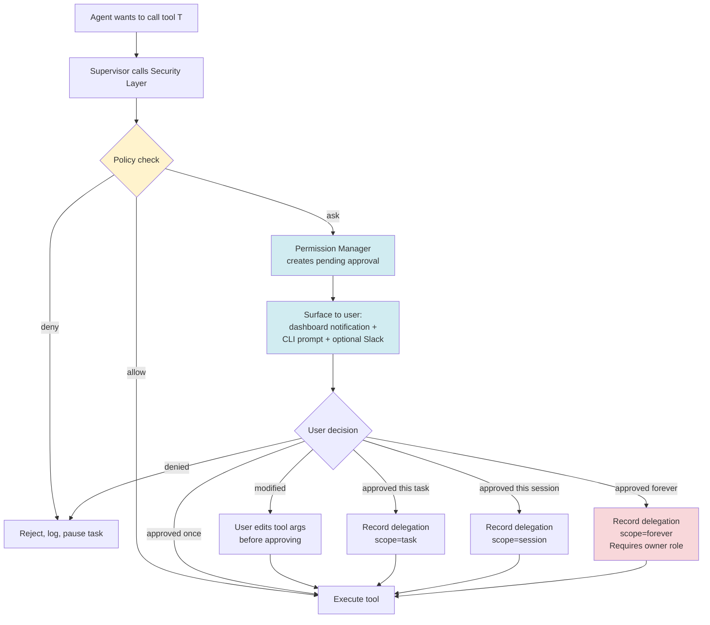

# 06 — Security Model

> **Audience:** security reviewers, implementers, operators.
> **Purpose:** define the zero-trust security architecture: identity, authorization, secrets, sandboxing, audit, and the permission approval flow. This is the most important architecture document — every other design decision is subordinate to it.

---

## 1. Threat model

We assume a threat model where:

1. **The LLM provider is honest but curious.** The provider will not maliciously route responses, but it may log prompts and responses. AAiOS never sends secrets, credentials, or PII to providers unless the user has explicitly marked that memory scope as "transmittable."
2. **Plugins may be malicious.** A plugin from the marketplace may attempt to exfiltrate data, escalate privileges, or persist beyond uninstall. Plugins run sandboxed and permission-gated.
3. **MCP servers may be compromised.** A compromised MCP server may return malicious tool-call results or attempt to chain into other tools. MCP tool calls are validated against schemas and rate-limited.
4. **The user's machine may be shared.** AAiOS may run on a developer's laptop that other processes can access. Secrets are encrypted at rest; the audit log is append-only and tamper-evident.
5. **The network is hostile.** All inter-service traffic is TLS-terminated. All outbound calls go through a single egress proxy with allow-listed destinations.

We do **not** assume:
- The user is adversarial (single-tenant, the user owns the system).
- The kernel is compromised (if it is, all bets are off — this is true of every OS).
- The hardware is compromised (out of scope for v1; HSM integration is a v1.1).

## 2. Identity

### 2.1 User identity
- **OAuth2** for interactive login. Supported providers: GitHub, Google, Microsoft, self-hosted Keycloak. The OAuth flow is server-side (PKCE), with the access token stored encrypted at rest and refreshed via the refresh token.
- **API keys** for programmatic access. Keys are 32-byte random, base64url-encoded, prefixed with `aaios_` for identification. Keys are hashed (Argon2id) at rest — the plaintext is shown once at creation.
- **Local mode** for single-user desktop deployments. No auth; the system binds to `127.0.0.1` only. This is the default for `docker compose up` on a laptop.

### 2.2 Agent identity
Every agent has a stable identity (`agent:claude-code`, `agent:hermes`, etc.). Agent identity is used in the audit log and in permission checks. An agent cannot impersonate another agent — the supervisor signs every dispatch with its own identity, and the agent inherits that signature for the duration of the step.

### 2.3 Plugin identity
Every plugin has a publisher identity (verified at install time via the marketplace's signature) and a plugin identity (`plugin:slack`, `plugin:weather`, etc.). Plugin identity is used in permission checks and in the audit log.

## 3. Authorization

### 3.1 RBAC + ABAC
Authorization is a hybrid of role-based and attribute-based:

- **Roles** (RBAC): `owner`, `admin`, `operator`, `viewer`. Roles are assigned to users and grant broad action classes.
- **Attributes** (ABAC): every permission check also considers the *resource attributes* — which project, which memory scope, which file path, which network host. A user with `operator` role may have access to project A but not project B.

The policy engine evaluates `(actor, action, resource, context) -> allow | deny | ask`. The `ask` outcome is what triggers the interactive permission approval flow.

### 3.2 Permission catalog
Every action in the system maps to a permission from a fixed catalog:

| Permission | Description | Default for owner | Default for operator | Default for viewer |
|-----------|-------------|:-:|:-:|:-:|
| `task.submit` | Submit a new task | ✓ | ✓ | ✗ |
| `task.pause` | Pause a running task | ✓ | ✓ | ✗ |
| `task.rollback` | Roll back a task to a prior step | ✓ | ✗ | ✗ |
| `agent.dispatch` | Dispatch an agent (supervisor only) | — | — | — |
| `tool.call` | Call a specific tool | ask | ask | ✗ |
| `memory.read` | Read from a memory scope | ✓ | scope-limited | scope-limited |
| `memory.write` | Write to a memory scope | ✓ | scope-limited | ✗ |
| `plugin.install` | Install a new plugin | ✓ | ✗ | ✗ |
| `plugin.uninstall` | Uninstall a plugin | ✓ | ✗ | ✗ |
| `provider.configure` | Add or modify an LLM provider | ✓ | ✗ | ✗ |
| `secret.read` | Read a secret from the secret store | ✓ | ✗ | ✗ |
| `audit.read` | Read the audit log | ✓ | ✓ | ✓ (own actions only) |

The `ask` default means the system will surface a permission prompt to the user the first time, and remember the response (per the delegation policy below).

### 3.3 Delegation policy
When the user approves an action, they can choose the scope of the approval:

- **Once** — re-ask next time.
- **This task** — remember for the duration of this task.
- **This session** — remember until the user logs out or the session expires (default 8 hours).
- **Forever** — remember permanently. Requires `owner` role. Audit-logged prominently.

The default is `This task`. `Forever` is opt-in and shown with a warning.

## 4. Secret management

### 4.1 Secret store
Secrets (API keys, OAuth tokens, database passwords, plugin credentials) live in the Secret Store, which is:

- **Encrypted at rest** with AES-128-CBC + HMAC-SHA256 (Fernet). The master key is derived from a user-provided passphrase (PBKDF2, 600k iterations) or read from a host key file (`/etc/aaios/master.key`, mode 0600).
- **Never logged.** The secret store API returns opaque `SecretRef` objects that contain only the secret's ID and metadata. The plaintext is only ever materialized inside the gateway, in memory, for the duration of a single call.
- **Rotatable.** The master key can be rotated; re-encryption runs in the background.
- **Auditable.** Every read is logged with the reader's identity, the secret's ID, and the timestamp — but never the secret's value.

### 4.2 Secret references in config
Configuration files never contain secret values. They contain `SecretRef` placeholders:

```yaml
providers:
  openai:
    api_key: ${secret:openai/api_key}
    org_id: ${secret:openai/org_id}
```

The Configuration Manager resolves `${secret:...}` references at load time by calling the Secret Store. The resolved value never enters the config cache — it is fetched fresh on each access.

### 4.3 Secret transmission to agents
When an agent needs a secret (e.g., Claude Code needs the GitHub token to push), the supervisor:

1. Checks that the agent's permission profile allows access to that secret.
2. Materializes the secret value from the Secret Store.
3. Passes it to the agent via the JSON-RPC `execute` call, in the `secrets` field.
4. The agent is responsible for not logging it, not persisting it, and clearing it from memory when done.
5. The supervisor logs that the secret was shared, with whom, and for what task — but not the value.

## 5. Sandboxing

### 5.1 Plugin sandbox
Plugins run in a restricted Python environment:

- `__builtins__` is replaced with a safe subset (no `exec`, `eval`, `open`, `__import__` for arbitrary modules).
- Filesystem access is mediated by the gateway — plugins call `aaios.fs.read(path)`, not `open(path)`.
- Network access is mediated by the gateway — plugins call `aaios.http.request(...)`, not `requests.get(...)`.
- Subprocess spawning is forbidden.
- The plugin's import graph is validated at load time against an allow-list.

On Linux, additional defense-in-depth is provided by running each plugin in a seccomp-filtered thread that blocks `fork`, `exec`, `socket` (except via the gateway's pre-opened file descriptors).

### 5.2 Agent subprocess sandbox
Claude Code and Hermes run as OS subprocesses. Their sandboxing is at the OS level:

- **Claude Code:** runs with the user's UID but is restricted to the project root directory via `bwrap` (bubblewrap) or `chroot`. Network is allow-listed to specific hosts (the LLM provider, the git host). Shell commands are executed via a wrapper that blocks specific binaries (`rm -rf /`, `dd if=/dev/zero of=/dev/sda`, etc.).
- **Hermes:** runs with the user's UID and has full desktop access *only after the user has explicitly granted it for the current task*. There is no filesystem sandbox for Hermes — by design, it needs to interact with the whole desktop. The mitigation is the Permission Manager's per-task approval and the audit log.

### 5.3 MCP server sandbox
MCP servers run as their own subprocesses. They are:

- Allow-listed for network egress (each MCP server declares its required hosts in its manifest).
- Rate-limited (max N tool calls per minute, configurable per server).
- Resource-limited (max memory, max CPU, max open file descriptors, enforced via cgroups on Linux).
- Time-limited (every tool call has a timeout, default 30s, configurable).

## 6. Audit log

### 6.1 What is logged
The audit log is append-only and contains an entry for every:

- Authentication attempt (success and failure).
- Authorization decision (allow, deny, ask, and the eventual response).
- Secret access (which secret, by whom, for what task — never the value).
- Agent dispatch (which agent, for what step, with what permissions).
- Tool call (which tool, with what arguments, returning what status — arguments and return values are redacted for sensitive tools).
- Plugin lifecycle event (install, enable, disable, uninstall, reload, crash).
- Configuration change (which key, old value, new value, by whom).
- External action (file written, network request sent, shell command executed).

### 6.2 Tamper-evidence
The audit log is tamper-evident via a hash chain: every entry contains the SHA-256 of the previous entry. The genesis hash is published at boot. Any tampering is detectable by recomputing the chain. The log is also write-once at the filesystem level (append-only file with the append-only attribute set on Linux).

### 6.3 Retention
Default retention is 90 days. Operators can extend this. After retention, entries are archived to cold storage (S3-compatible) with the same hash chain.

## 7. Permission approval flow



Key properties:
- The user can always edit tool arguments before approving (e.g., narrow a file path, change a URL). This is critical for safety — the agent may have proposed an overly-broad file write.
- The user can revoke any delegation at any time from the dashboard.
- "Forever" approvals require `owner` role and are highlighted in the audit log.
- If the user does not respond within the task's timeout (default 5 minutes), the task is paused, not failed.

## 8. Network egress

All outbound network traffic (except to the LLM provider and the MCP servers) goes through a single egress proxy. The egress proxy enforces:

- **Allow-list** of destinations (configured by the operator). Default allow-list: LLM provider hosts, MCP server hosts, the plugin marketplace, GitHub.
- **TLS pinning** for the LLM provider hosts (defends against MITM with a mis-issued cert).
- **Request logging** (URL, headers except Authorization, response status) — never body.
- **Rate limiting** per destination.

This is what allows the operator to say "this AAiOS instance may only talk to OpenAI and GitHub, nothing else" — and have that be enforced at the network level, not just at the application level.

## 9. Vulnerability management

- **`pip-audit` and `npm audit`** run on every PR. Any Critical or High finding blocks merge.
- **Dependabot / Renovate** opens PRs for outdated deps.
- **`bandit`** runs on every PR for Python static security analysis.
- **`gitleaks`** runs on every commit and on every push. Any secret in code blocks the push (GitHub push protection also enabled at the repo level).
- **Trivy** scans every built Docker image. Critical findings block the release.
- **Snyk Code** (or equivalent) runs on every PR for taint analysis.

## 10. Incident response

If a vulnerability is discovered:

1. The maintainer files a GitHub Security Advisory (private).
2. A fix is developed on a private branch.
3. A patched release is cut and announced simultaneously with the advisory publication.
4. The audit log is reviewed for exploitation indicators (specifically: unusual secret accesses, unusual tool calls, unusual plugin installs).

The project follows a 90-day disclosure window by default, negotiable with the reporter.

---

This concludes the security model. For how the system is deployed within these constraints, see [`07-deployment-topology.md`](07-deployment-topology.md).
