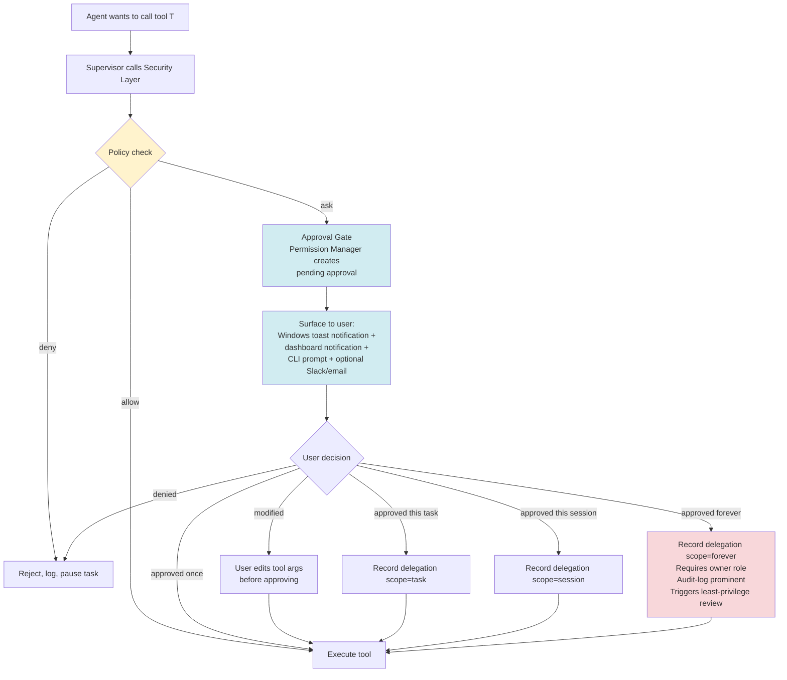

# 07 — Security Model

> **Audience:** security reviewers, implementers, operators.
> **Purpose:** the zero-trust security architecture: identity, authorization, secrets (with rotation), sandboxing (Windows-first), audit, and the permission approval flow. **Every other architectural decision is subordinate to this document.**

---

## 1. Threat model

We assume a threat model where:

1. **The LLM provider is honest but curious.** The provider may log prompts and responses. AAiOS never sends secrets, credentials, or PII to providers unless the user has explicitly marked that memory scope as "transmittable."
2. **Plugins may be malicious.** A plugin from the marketplace may attempt to exfiltrate data, escalate privileges, or persist beyond uninstall. Plugins run sandboxed and permission-gated.
3. **MCP servers may be compromised.** A compromised MCP server may return malicious tool-call results or attempt to chain into other tools. MCP tool calls are validated against schemas and rate-limited.
4. **The user's machine may be shared.** AAiOS may run on a developer's Windows laptop that other processes can access. Secrets are encrypted at rest; the audit log is append-only and tamper-evident.
5. **The network is hostile.** All inter-service traffic is TLS-terminated. All outbound calls go through a single egress proxy with allow-listed destinations.
6. **Future agents (OpenHands, Cline, Roo Code, Gemini CLI, Codex CLI, etc.) may have their own vulnerabilities.** They run sandboxed as subprocesses with minimal privileges and cannot affect the supervisor process.

We do **not** assume:
- The user is adversarial (single-tenant; the user owns the system).
- The Windows kernel is compromised (if it is, all bets are off).
- The hardware is compromised (out of scope for v1; TPM 2.0 integration is a v1.1 stretch).

## 2. Identity

### 2.1 User identity
- **OAuth2** for interactive login. Supported providers: GitHub, Google, Microsoft, self-hosted Keycloak. The OAuth flow is server-side (PKCE); the access token is stored encrypted at rest and refreshed via the refresh token.
- **API keys** for programmatic access. Keys are 32-byte random, base64url-encoded, prefixed with `aaios_`. Keys are hashed (Argon2id) at rest — the plaintext is shown once at creation.
- **Local mode** for single-user Windows desktop deployments. No auth; the system binds to `127.0.0.1` only. This is the default for the Windows installer.

### 2.2 Agent identity
Every agent — including the Supervisor — has a stable identity (`agent:claude-code-v1`, `agent:hermes-v1`, `agent:openhands-v1`, etc.). Agent identity is used in the audit log and in permission checks. An agent cannot impersonate another agent — the supervisor signs every dispatch with its own identity, and the agent inherits that signature for the duration of the step.

### 2.3 Plugin identity
Every plugin has a publisher identity (verified at install time via the marketplace's signature) and a plugin identity (`plugin:slack`, `plugin:openhands-agent`, etc.). Plugin identity is used in permission checks and in the audit log.

### 2.4 Windows service account
The AAiOS Windows Services run as a dedicated local service account (`.\AAiOS`) created by the installer. The account has:
- **Log on as a service** right.
- **Read** access to `%ProgramFiles%\AAiOS\` and `%ProgramData%\AAiOS\config\`.
- **Read/Write** access to `%ProgramData%\AAiOS\data\` and `%ProgramData%\AAiOS\logs\`.
- **No** interactive desktop logon right.
- **No** administrator privileges.
- **No** network share access.

This is the least-privilege baseline. Operators can further restrict via Windows Group Policy.

## 3. Authorization

### 3.1 RBAC + ABAC
Authorization is a hybrid of role-based and attribute-based:

- **Roles** (RBAC): `owner`, `admin`, `operator`, `viewer`. Roles are assigned to users and grant broad action classes.
- **Attributes** (ABAC): every permission check also considers the *resource attributes* — which project, which memory scope, which file path, which network host. A user with `operator` role may have access to project A but not project B.

The policy engine evaluates `(actor, action, resource, context) -> allow | deny | ask`. The `ask` outcome is what triggers the interactive permission approval flow.

### 3.2 Permission catalog (subset)

| Permission | Description | Default for owner | Default for operator | Default for viewer |
|-----------|-------------|:-:|:-:|:-:|
| `task.submit` | Submit a new task | ✓ | ✓ | ✗ |
| `task.pause` | Pause a running task | ✓ | ✓ | ✗ |
| `task.rollback` | Roll back a task to a prior checkpoint | ✓ | ✗ | ✗ |
| `agent.dispatch` | Dispatch an agent (supervisor only) | — | — | — |
| `tool.call` | Call a specific tool | ask | ask | ✗ |
| `memory.read` | Read from a memory scope | ✓ | scope-limited | scope-limited |
| `memory.write` | Write to a memory scope | ✓ | scope-limited | ✗ |
| `plugin.install` | Install a new plugin | ✓ | ✗ | ✗ |
| `plugin.uninstall` | Uninstall a plugin | ✓ | ✗ | ✗ |
| `provider.configure` | Add or modify an LLM provider | ✓ | ✗ | ✗ |
| `secret.read` | Read a secret | ✓ | ✗ | ✗ |
| `secret.rotate` | Rotate a secret | ✓ | ✗ | ✗ |
| `audit.read` | Read the audit log | ✓ | ✓ | ✓ (own actions only) |
| `agent.pin` | Pin a specific agent for a capability | ✓ | ✗ | ✗ |

### 3.3 Least-privilege enforcement (new)
The Security Layer includes a **least-privilege analyzer** that audits each agent's declared permissions against what it actually uses:

- Every agent declares `permissions_required` in its capability manifest (what it needs at minimum).
- Every tool call is logged with the actual permission exercised.
- The analyzer runs nightly (and on-demand) and reports:
  - **Over-permissioned agents** — declared permissions that are never used in the last 30 days. Recommends revocation.
  - **Under-permissioned agents** — agents that hit a `deny` decision more than 3× in the last 7 days. Recommends adding the permission (after human review).
  - **Permission drift** — agents whose effective permission set differs from the declared set by more than 20%.
- The report is surfaced on the dashboard's Security page and can be auto-applied with owner approval.

### 3.4 Delegation policy
When the user approves an action, they choose the scope:

- **Once** — re-ask next time.
- **This task** — remember for the duration of this task.
- **This session** — remember until logout or session expiry (default 8 hours).
- **Forever** — remember permanently. Requires `owner` role. Audit-logged prominently. Requires secret rotation if the delegated action involves a secret.

The default is `This task`. `Forever` is opt-in, shown with a warning, and reviewed by the least-privilege analyzer monthly.

## 4. Secret management

### 4.1 Secret store
Secrets (API keys, OAuth tokens, database passwords, plugin credentials) live in the Secret Store, which is:

- **Encrypted at rest** with AES-128-CBC + HMAC-SHA256 (Fernet). The master key is derived from a user-provided passphrase (PBKDF2, 600k iterations) or read from a host key file (`%ProgramData%\AAiOS\master.key`, ACL-restricted to the service account).
- **Never logged.** The Secret Store API returns opaque `SecretRef` objects that contain only the secret's ID and metadata. The plaintext is only materialized inside the Gateway, in memory, for the duration of a single call.
- **Rotatable.** The master key can be rotated; re-encryption runs in the background. Individual secrets can be rotated without affecting the master key (see 4.4).
- **Auditable.** Every read is logged with the reader's identity, the secret's ID, and the timestamp — never the value.

### 4.2 Secret references in config
Configuration files never contain secret values. They contain `SecretRef` placeholders:

```yaml
providers:
  openai:
    api_key: ${secret:openai/api_key}
    org_id: ${secret:openai/org_id}
```

The Configuration Manager resolves `${secret:...}` references at load time by calling the Secret Store. The resolved value never enters the config cache — it is fetched fresh on each access.

### 4.3 Secret transmission to agents
When an agent needs a secret (e.g., a CodingAgent needs the GitHub token to push), the supervisor:

1. Checks that the agent's permission profile allows access to that secret.
2. Materializes the secret value from the Secret Store.
3. Passes it to the agent via the JSON-RPC `execute_task` call, in the `secrets` field.
4. The agent is responsible for not logging it, not persisting it, and clearing it from memory when done.
5. The supervisor logs that the secret was shared, with whom, and for what task — but not the value.

### 4.4 Secret rotation (new)
Every secret in the Secret Store has a rotation policy:

```python
class RotationPolicy(BaseModel):
    interval_days: int | None       # None = manual only
    last_rotated: datetime
    next_rotation: datetime
    rotation_strategy: Literal["manual", "auto_request", "auto_rotate"]
    on_rotation_failure: Literal["alert", "alert_and_disable", "alert_and_fallback"]
```

- **Manual** — the user rotates via the dashboard. The old secret is kept for a configurable grace period (default 24h) so in-flight tasks can finish.
- **Auto-request** — the Security Layer emits `secret.rotation_due` 7 days before expiry; the dashboard surfaces it; the user rotates manually.
- **Auto-rotate** — supported for OAuth refresh tokens (rotated transparently) and for secrets backed by a rotation provider (AWS Secrets Manager, Azure Key Vault, HashiCorp Vault). The Secret Store calls the provider's rotation API, validates the new value, swaps atomically, and emits `secret.rotated`.

The rotation log is part of the audit log. Failed rotations alert the user via the dashboard and (optionally) email/Slack.

### 4.5 Master key rotation
The master key (used to encrypt all secrets) can be rotated independently:
1. Generate a new master key.
2. Re-encrypt every secret with the new key (background job, rate-limited).
3. Once re-encryption is complete, atomically swap the active key file.
4. The old key is kept for a grace period (default 30 days) for emergency rollback.
5. Emit `master_key.rotated` to the audit log.

## 5. Sandboxing (Windows-first)

### 5.1 Plugin sandbox
Plugins run in a restricted Python environment:

- `__builtins__` is replaced with a safe subset (no `exec`, `eval`, `open`, `__import__` for arbitrary modules).
- Filesystem access is mediated by the Gateway — plugins call `aaios.gateway.fs.read(path)`, not `open(path)`.
- Network access is mediated by the Gateway — plugins call `aaios.gateway.net.request(...)`, not `requests.get(...)`.
- Subprocess spawning is forbidden — plugins that need to spawn processes (e.g., a CodingAgent plugin wrapping a CLI) declare it in their manifest and the Gateway spawns on their behalf.
- The plugin's import graph is validated at load time against an allow-list.

On Windows, additional defense-in-depth:
- Each plugin runs in a **Job Object** with CPU/memory/child-process limits.
- The plugin worker process runs in an **AppContainer** low-privilege AppContainer, with capabilities declared per plugin.
- Optional **WDAC (Windows Defender Application Control)** policy restricts which binaries the plugin can invoke.
- Windows Defender scans every downloaded plugin before installation; if it flags the plugin, installation is blocked.

### 5.2 Agent subprocess sandbox
CodingAgent implementations (Claude Code, future OpenHands, Cline, etc.) and DesktopAgent implementations (Hermes, future others) run as OS subprocesses. Their sandboxing is at the OS level:

- **Job Object:** every agent subprocess is assigned to a Job Object that enforces:
  - CPU and memory limits (per the agent's `ResourceRequirements`).
  - Child-process grouping — killing the agent kills all its descendants (critical for Hermes spawning browser processes).
  - UI restrictions — agents cannot display dialogs on the user's desktop unless explicitly granted.
- **Restricted token:** the agent subprocess runs with a restricted Windows token that:
  - Removes the `Administrators` group (even if the parent is elevated).
  - Removes `SeDebugPrivilege`, `SeShutdownPrivilege`, etc.
  - Denies write access to system directories.
- **AppContainer (optional, for high-risk agents):** the agent runs inside an AppContainer with a per-agent capability SID. Filesystem and registry writes are blocked except to the agent's assigned directories.
- **WDAC (optional, for enterprise deployments):** a policy restricts the agent to a specific allow-list of binaries.
- **Filesystem sandbox (CodingAgent):** the agent's filesystem access is restricted to the project root directory via the Gateway's `fs` sub-gateway. Native Win32 `CreateFile` calls outside the sandbox are blocked by the restricted token's ACL.
- **Network egress (CodingAgent):** the agent's network access is allow-listed to specific hosts (the LLM provider, the git host). Other hosts are blocked at the Gateway level.
- **DesktopAgent exception:** DesktopAgents (Hermes, future others) require full desktop access by design. Their sandbox is *not* filesystem-restricted — by design, they need to interact with the whole desktop. The mitigation is the per-task approval gate (see §7) and the audit log. The Job Object still enforces resource limits and child-process grouping.

### 5.3 MCP server sandbox
MCP servers run as their own subprocesses. They are:

- Allow-listed for network egress (each MCP server declares its required hosts in its manifest).
- Rate-limited (max N tool calls per minute, configurable per server).
- Resource-limited (max memory, max CPU, max open handles — enforced via Job Objects on Windows).
- Time-limited (every tool call has a timeout, default 30s, configurable).
- Sandboxed at the same level as agent subprocesses (restricted token + Job Object).

## 6. Audit log

### 6.1 What is logged
The audit log is append-only and contains an entry for every:

- Authentication attempt (success and failure).
- Authorization decision (allow, deny, ask, and the eventual response).
- Secret access (which secret, by whom, for what task — never the value).
- Secret rotation (manual and automatic; old and new key fingerprints, never values).
- Agent dispatch (which agent, for what step, with what permissions).
- Capability Selector decision (which agents were candidates, which was chosen, the score breakdown, the reasoning trace).
- Tool call (which tool, with what arguments, returning what status — arguments and return values are redacted for sensitive tools).
- Plugin lifecycle event (install, enable, disable, uninstall, reload, crash).
- Configuration change (which key, old value, new value, by whom).
- External action (file written, network request sent, shell command executed).
- Checkpoint written, checkpoint restored, task paused, task resumed, task cancelled.
- Approval gate requested, approval gate responded.

### 6.2 Tamper-evidence
The audit log is tamper-evident via a hash chain: every entry contains the SHA-256 of the previous entry. The genesis hash is published at boot. Any tampering is detectable by recomputing the chain. The log is also write-once at the filesystem level (Windows: file ACL denies `DELETE` and `WRITE` to all accounts except `SYSTEM`, and the file is opened with `FILE_APPEND_DATA` only).

### 6.3 Retention
Default retention is 90 days. Operators can extend this. After retention, entries are archived to cold storage (S3-compatible, or Azure Blob) with the same hash chain.

## 7. Permission approval flow



Key properties:
- The user can always edit tool arguments before approving (e.g., narrow a file path, change a URL). This is critical for safety — the agent may have proposed an overly-broad file write.
- The user can revoke any delegation at any time from the dashboard.
- "Forever" approvals require `owner` role, are highlighted in the audit log, and trigger a least-privilege review.
- If the user does not respond within the task's timeout (default 5 minutes), the task is paused, not failed.
- Windows toast notifications are used for desktop deployments; the dashboard badge and CLI prompt are always used.

## 8. Network egress

All outbound network traffic (except to the LLM provider and the MCP servers) goes through a single egress proxy. The egress proxy enforces:

- **Allow-list** of destinations (configured by the operator). Default allow-list: LLM provider hosts, MCP server hosts, the plugin marketplace, GitHub.
- **TLS pinning** for the LLM provider hosts (defends against MITM with a mis-issued cert).
- **Request logging** (URL, headers except Authorization, response status) — never body.
- **Rate limiting** per destination.

On Windows, the egress proxy is implemented as part of the Gateway (`gateway.net`). It uses Windows Filtering Platform (WFP) for kernel-level enforcement on enterprise deployments (optional), and application-level enforcement for desktop deployments.

## 9. Vulnerability management

- **`pip-audit` and `npm audit`** run on every PR. Any Critical or High finding blocks merge.
- **Dependabot / Renovate** opens PRs for outdated deps.
- **`bandit`** runs on every PR for Python static security analysis.
- **`gitleaks`** runs on every commit and on every push. Any secret in code blocks the push (GitHub push protection also enabled at the repo level).
- **Trivy** scans every built Docker image (when Docker is used).
- **Windows Defender** scans every downloaded plugin before installation.
- **`sc.exe qfailure`** is checked for every Windows Service to verify auto-restart is configured.
- **`Get-Acl`** is run by `aaios doctor` to verify file ACLs on the data directory, config directory, and master key file.

## 10. Incident response

If a vulnerability is discovered:

1. The maintainer files a GitHub Security Advisory (private).
2. A fix is developed on a private branch.
3. A patched release is cut and announced simultaneously with the advisory publication.
4. The audit log is reviewed for exploitation indicators (specifically: unusual secret accesses, unusual tool calls, unusual plugin installs, capability selector decisions that look coerced).

The project follows a 90-day disclosure window by default, negotiable with the reporter.

For Windows-specific incidents:
- If a plugin is found to have escaped its sandbox, the WDAC policy is updated to block the offending binary, and a hotfix release is cut.
- If a secret is found to have leaked (e.g., committed to git by accident), the secret is rotated immediately, the audit log is reviewed for unauthorized use, and GitHub's secret scanning is verified to have caught it.

---

This concludes the security model. For how the system is deployed within these constraints on Windows, see [`08-deployment-topology.md`](08-deployment-topology.md).
