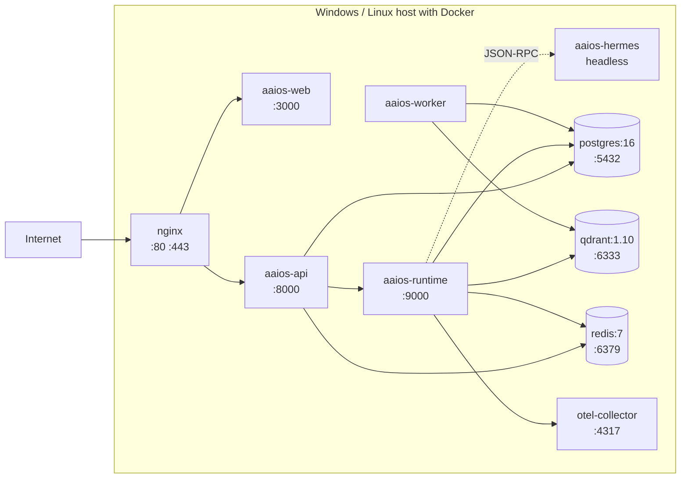

# 08 — Deployment Topology

> **Audience:** operators, DevOps.
> **Purpose:** define the **Windows-native** deployment topology (primary), the optional Docker Compose topology (secondary), networking, storage, the path to Linux, and the operational runbook.

---

## 1. Reference deployment — Windows-native (primary)

The primary deployment is **native Windows 11**: install via an Inno Setup installer, run as Windows Services, schedule via Task Scheduler. No Docker required.

### 1.1 Target hardware
- **Laptop / desktop** (developer or power user): Windows 11, 16 GB RAM, 4 cores, 50 GB free disk. Runs the supervisor + API + Web + Hermes (desktop automation) + SQLite + Qdrant. Skips Postgres, Redis, OTel collector.
- **Workgroup server** (team of up to 10 users): Windows 11 Pro or Windows Server 2022, 32 GB RAM, 8 cores, 200 GB SSD. Runs the full native stack.
- **Department server** (up to 50 users): Windows Server 2022, 64 GB RAM, 16 cores, 500 GB SSD. Full stack + worker pool + Memurai (Redis-compatible).

### 1.2 Service topology (Windows-native)

```mermaid
flowchart LR
    subgraph Win["Windows 11 / Server 2022 host"]
        subgraph Svc["Windows Services (run as .\\AAiOS account)"]
            WEB[aaios-web<br/>Next.js 16 (Node 22)<br/>port 3000]
            API[aaios-api<br/>FastAPI + Uvicorn<br/>port 8000]
            RUNTIME[aaios-runtime<br/>Supervisor + Agent Registry<br/>port 9000 internal]
            HERMES[aaios-hermes<br/>Desktop daemon<br/>auto-started on-demand]
            WORKER[aaios-worker<br/>Background jobs]
        end
        subgraph Data["Data services"]
            PG[(PostgreSQL 16<br/>port 5432)]
            QDRANT[(Qdrant<br/>port 6333)]
            MEMURAI[(Memurai<br/>port 6379<br/>optional)]
        end
        subgraph Obs["Observability"]
            OTEL[OTel Collector<br/>port 4317]
        end
        subgraph OS["Windows OS"]
            TS[Task Scheduler<br/>for recurring tasks]
            NLB[HTTP.sys / IIS<br/>reverse proxy<br/>port 80/443]
            DEF[Windows Defender<br/>on-access scan]
        end
    end

    Internet --> NLB
    NLB --> WEB
    NLB --> API
    API --> RUNTIME
    API --> PG
    API --> MEMURAI
    RUNTIME --> PG
    RUNTIME --> QDRANT
    RUNTIME --> MEMURAI
    RUNTIME -.->|JSON-RPC<br/>stdin/stdout| HERMES
    RUNTIME --> OTEL
    WORKER --> PG
    WORKER --> QDRANT
    WEB -.->|WebSocket| API
    RUNTIME --> TS
    DEF -.->|scans plugin downloads| RUNTIME
```

### 1.3 Windows Services

| Service name | Binary | Purpose | Recovery | Account |
|--------------|--------|---------|----------|---------|
| `AAiOS-Web` | `node.exe web/server.js` | Next.js dashboard | restart × 3, then fail | `.\AAiOS` |
| `AAiOS-API` | `python -m aaios.surfaces.api` | FastAPI REST + WS | restart × 3, then fail | `.\AAiOS` |
| `AAiOS-Runtime` | `python -m aaios.supervisor.runtime` | Supervisor + Agent Registry + Task Orchestrator | restart × 3, then fail | `.\AAiOS` |
| `AAiOS-Hermes` | `python -m aaios.agents.hermes.daemon` | Desktop automation (auto-started when a desktop task is dispatched) | restart × 3, then fail | Interactive user (for desktop access) |
| `AAiOS-Worker` | `python -m aaios.worker` | Background jobs (embeddings, summarization, large processing) | restart × 3, then fail | `.\AAiOS` |

Services are installed via NSSM (preferred — handles crashes gracefully) or `pywin32`'s `win32serviceutil`. The installer configures:
- Recovery actions: restart at 1min, 2min, 5min; then fail (flag for human attention).
- `sc description` for each service.
- `sc failure` settings.
- Event Log source registration for each service.

### 1.4 Data services
- **PostgreSQL 16:** installed via the EnterpriseDB Windows installer. Runs as a Windows Service (`postgresql-16`). Database `aaios`, user `aaios`. Data directory: `%ProgramData%\AAiOS\data\postgres\`.
- **Qdrant 1.10:** Windows binary from Qdrant's GitHub releases. Runs as a Windows Service (registered via NSSM). Storage: `%ProgramData%\AAiOS\data\qdrant\`.
- **Memurai 4** (optional): Redis-compatible, Windows-native. Used only for multi-process deployments. Skipped in single-machine mode (the in-process event bus + SQLite is sufficient).

### 1.5 Reverse proxy
- **HTTP.sys** (Windows built-in) for TLS termination in production — kernel-level, fast, supports HTTP/3.
- **IIS** with URL Rewrite + Application Request Routing (ARR) as an alternative for enterprise deployments that already have IIS.
- **Caddy** as a cross-platform alternative for users who prefer a single config file.

The installer sets up HTTP.sys with a self-signed cert by default and walks the user through Let's Encrypt (via `win-acme`) or bring-your-own-cert for production.

### 1.6 Task Scheduler integration
The Orchestrator's scheduler persists scheduled tasks to Windows Task Scheduler for durability:
- Each scheduled AAiOS task maps to a Task Scheduler entry.
- The Task Scheduler entry runs `aaios.exe run --scheduled <task_id>` at the configured time.
- The Orchestrator keeps an in-process schedule cache (refreshed every 30s and on `task.scheduled` events) for fast lookup.
- On boot, the Orchestrator syncs its cache from Task Scheduler — any orphaned Task Scheduler entries are cleaned up.

### 1.7 Windows Defender integration
- **On-access scan** for `%ProgramData%\AAiOS\data\plugins\` (scans every downloaded plugin before extraction).
- **Exclusions** for `%ProgramData%\AAiOS\data\postgres\` and `%ProgramData%\AAiOS\data\qdrant\` (these have their own integrity checks; AV scanning slows them down significantly).
- **Controlled Folder Access** (Windows Defender feature) enabled for the data directory — blocks unauthorized processes from modifying AAiOS data.
- **Attack Surface Reduction rules** applied to the AAiOS service account (blocks Office macro spawning, executable content from email, etc.).

## 2. Windows file system layout

```
C:\Program Files\AAiOS\                       # binaries (read-only, installer-managed)
    ├─ bin\
    │   ├─ aaios.exe                          # CLI entry point
    │   ├─ python\                            # bundled Python 3.12
    │   └─ node\                              # bundled Node 22
    ├─ lib\                                   # Python packages (site-packages)
    ├─ web\                                   # Next.js build output
    └─ share\
        ├─ defaults\                          # default config templates
        └─ agents\                            # built-in agent implementations

%ProgramData%\AAiOS\                          # system-wide data
    ├─ config\
    │   ├─ config.yaml                        # main config
    │   ├─ providers.yaml                     # LLM provider config
    │   ├─ agents\                            # per-agent config overrides
    │   └─ mcp-servers\                       # MCP server configs
    ├─ data\
    │   ├─ postgres\                          # Postgres data
    │   ├─ qdrant\                            # Qdrant storage
    │   ├─ runtime\                           # supervisor scratch + checkpoints
    │   ├─ plugins\                           # installed plugins (downloaded → extracted)
    │   ├─ eventstore\                        # SQLite fallback event store (if no Postgres)
    │   └─ workspaces\                        # CodingAgent project workspaces (sandboxed)
    ├─ logs\
    │   ├─ aaios-api.log                      # rotating, 100MB × 7
    │   ├─ aaios-runtime.log
    │   ├─ aaios-worker.log
    │   ├─ aaios-hermes.log
    │   └─ audit\                             # append-only audit log
    │       └─ audit-YYYY-MM.log
    └─ master.key                             # secret-encryption master key (ACL: SYSTEM + .\AAiOS only)

%APPDATA%\AAiOS\                              # per-user (for interactive runs)
    ├─ tokens\                                # OAuth tokens
    ├─ memory\                                # per-user memory scope overrides
    └─ preferences.json                       # dashboard preferences

%TEMP%\AAiOS\                                 # per-user temp, cleaned on service start
```

ACLs:
- `C:\Program Files\AAiOS\` — `SYSTEM` + `Administrators` (read/execute); `Users` (read/execute).
- `%ProgramData%\AAiOS\config\` — `SYSTEM` + `.\AAiOS` (read); `Administrators` (read/write).
- `%ProgramData%\AAiOS\data\` — `SYSTEM` + `.\AAiOS` (read/write); `Users` (no access).
- `%ProgramData%\AAiOS\logs\` — `SYSTEM` + `.\AAiOS` (read/write); `Administrators` (read).
- `%ProgramData%\AAiOS\master.key` — `SYSTEM` + `.\AAiOS` (read); everyone else denied.
- `%ProgramData%\AAiOS\logs\audit\` — `SYSTEM` + `.\AAiOS` (append-only via `FILE_APPEND_DATA`).

The installer sets these ACLs; `aaios doctor` verifies them on every run.

## 3. Resource limits (per Windows Service)

| Service | CPU limit | Memory limit | Notes |
|---------|-----------|--------------|-------|
| `AAiOS-Web` | 1 CPU | 512 MB | Next.js Node process |
| `AAiOS-API` | 2 CPU | 1 GB | FastAPI + Uvicorn |
| `AAiOS-Runtime` | 4 CPU | 4 GB | Supervisor + Agent Registry + Task Orchestrator |
| `AAiOS-Hermes` | 2 CPU | 2 GB | Playwright + PyAutoGUI + Pywinauto |
| `AAiOS-Worker` | 2 CPU | 2 GB | Embeddings + summarization |
| PostgreSQL | 2 CPU | 2 GB | `shared_buffers=512MB` |
| Qdrant | 2 CPU | 2 GB | — |
| Memurai (optional) | 0.5 CPU | 256 MB | `maxmemory=200mb` |
| OTel Collector | 0.5 CPU | 256 MB | — |

CPU and memory limits are enforced via Job Objects on the service processes. The installer sets them via `sc config` + a small Job Object assignment utility.

Total reference footprint on a workgroup server: ~14 GB RAM, ~14 CPU cores. Fits comfortably on a 16-core / 32 GB server with headroom.

## 4. Configuration

### 4.1 Environment
All runtime configuration is via `%ProgramData%\AAiOS\config\config.yaml` + environment variable overrides. Secrets are referenced via `${secret:...}` and resolved from the Secret Store at access time.

```yaml
# config.yaml
env: production
secret_key: ${secret:system/master_key}

db:
  url: postgresql+asyncpg://aaios@localhost:5432/aaios
  pool_size: 10

qdrant:
  url: http://localhost:6333

# Redis is optional in single-machine mode
redis:
  url: null  # null = use in-process bus

providers:
  openai:
    api_key: ${secret:openai/api_key}
    priority: 1
  anthropic:
    api_key: ${secret:anthropic/api_key}
    priority: 2
  openrouter:
    api_key: ${secret:openrouter/api_key}
    priority: 3
  ollama:
    url: http://localhost:11434
    priority: 10  # local, used as fallback

# OAuth (optional; if null, local mode is used)
oauth:
  github:
    client_id: ...
    client_secret: ${secret:oauth/github/client_secret}

# Telemetry (optional)
otel:
  exporter_otlp_endpoint: http://localhost:4317

# Egress allow-list
egress:
  allowed_hosts:
    - api.openai.com
    - api.anthropic.com
    - openrouter.ai
    - github.com
    - api.github.com
    - '*://localhost:*'  # for local MCP servers
```

### 4.2 Secret bootstrap (Windows)
On first boot, if `master.key` is missing:
1. The installer prompts the user for a passphrase (or generates a random one and saves it to a USB key the user keeps offline).
2. The runtime derives the master key from the passphrase (PBKDF2, 600k iterations).
3. The master key is written to `%ProgramData%\AAiOS\master.key` with ACL `SYSTEM` + `.\AAiOS` only.
4. The Secret Store is initialized with the master key.

If `master.key` is lost, all secrets are unrecoverable. The installer prominently warns the user to back up the key (e.g., to a password manager or USB drive).

## 5. Health checks

Every Windows Service exposes `/healthz` (liveness) and `/readyz` (readiness):
- `/healthz` returns 200 if the process is alive and the event loop is not stuck.
- `/readyz` returns 200 if the process is alive AND all its dependencies are reachable (DB, Qdrant, Redis-if-configured).

The Windows Service recovery policy uses `/healthz` (via a watchdog script registered as a separate service) to trigger restarts. The reverse proxy uses `/readyz` to decide whether to route traffic.

`aaios doctor` (CLI command) runs a comprehensive health check:
- All services running? (`sc query`)
- All healthz endpoints responding?
- All readyz endpoints responding?
- File ACLs correct? (`Get-Acl`)
- Master key present and ACL-correct?
- Postgres reachable? Qdrant reachable?
- Egress allow-list configured?
- Backup configured?
- Windows Defender exclusions in place?
- At least one LLM provider configured?

`aaios doctor` exits non-zero on any failure and produces a JSON report for automation.

## 6. Backups

### 6.1 What to back up
- **Postgres:** `pg_dump` nightly via a Task Scheduler entry, retained 30 days. Includes the event store, audit log, configuration, plugin registry, agent track records.
- **Qdrant:** snapshot API nightly via a Task Scheduler entry, retained 30 days. Includes all vector memory.
- **Audit log:** nightly copy to Azure Blob / S3 / Backblaze B2, retained 1 year (compliance).
- **Configuration:** `%ProgramData%\AAiOS\config\` nightly, retained 30 days.
- **Master key:** backed up **once** at install time to a location of the user's choice (USB drive, password manager, Azure Key Vault). Not auto-backed-up (it shouldn't be on the same machine).

### 6.2 What not to back up
- Runtime scratch (`%ProgramData%\AAiOS\data\runtime\`) — recreatable from Postgres + Qdrant.
- Plugin downloads — can be re-downloaded from the marketplace.
- Temp — cleaned on service start.

### 6.3 Restore
1. Stop all AAiOS services: `Stop-Service AAiOS-*`.
2. Wipe `%ProgramData%\AAiOS\data\`.
3. Restore Postgres from `pg_dump`: `pg_restore -U aaios -d aaios backup.dump`.
4. Restore Qdrant: copy snapshot into `%ProgramData%\AAiOS\data\qdrant\snapshots\`, start Qdrant.
5. Restore audit log and config.
6. Restore the master key to its location (if the host was rebuilt).
7. Start services: `Start-Service AAiOS-*`.
8. Verify with `aaios doctor` and a smoke task.

## 7. Observability

### 7.1 Metrics
- Each service exports Prometheus metrics on `/metrics` (scraped by an optional Prometheus Windows service).
- Key metrics: `aaios_tasks_active`, `aaios_tasks_completed_total`, `aaios_agent_dispatch_total{agent_id,capability}`, `aaios_capability_selector_candidates{capability}`, `aaios_provider_call_total{provider,status}`, `aaios_provider_cost_usd_total{provider}`, `aaios_memory_vectors_total`, `aaios_audit_log_entries_total`, `aaios_permission_denied_total`, `aaios_approval_gate_pending`, `aaios_checkpoint_writes_total`.

### 7.2 Logs
- All services log structured JSON to stdout (captured by Windows Service logging to `%ProgramData%\AAiOS\logs\<service>.log`).
- Logs rotate at 100 MB, keep 7 files.
- Logs include correlation IDs matching events on the bus.
- Windows Event Log entries are also written for service start/stop/crash.

### 7.3 Traces
- OpenTelemetry traces are exported to the OTel Collector service, which can forward to Jaeger, Tempo, Honeycomb, Datadog, or Application Insights.
- Every task creates a root span. Every agent dispatch, every capability selector decision, every tool call, every LLM call creates a child span.

### 7.4 Dashboards
- The built-in AAiOS dashboard has a Telemetry page showing real-time metrics and recent traces.
- For production deployments, a Grafana stack is recommended (out of scope for v1).

## 8. Optional Docker Compose deployment (secondary)

For users who prefer Docker (or who deploy to Linux servers), a `docker-compose.yml` is provided. It runs the same services as containers:



This is the same topology as the native deployment, just containerized. Useful for:
- Linux server deployment (v1.1).
- Users who already have Docker Desktop set up.
- CI/CD testing.

The Docker Compose deployment is **not the recommended path** for Windows desktop users — the native installer is simpler and lighter.

## 9. Linux compatibility path (v1.1)

The codebase is structured so Linux support is additive:

| Windows component | Linux equivalent |
|--------------------|------------------|
| Windows Service (NSSM/pywin32) | systemd unit |
| Task Scheduler | systemd timer / cron |
| Job Objects + AppContainer + WDAC | seccomp + namespaces + AppArmor |
| HTTP.sys reverse proxy | nginx / Caddy |
| Windows Defender | ClamAV |
| Windows Event Log | journald |
| `Get-Acl` / `icacls` | `getfacl` / `setfacl` |
| PowerShell | bash |
| `%ProgramData%` / `%APPDATA%` | `/etc/aaios` / `~/.config/aaios` |

The `core/platform/` package has `windows.py` and `linux.py` adapters. v1 ships `windows.py` complete and `linux.py` stubbed. v1.1 completes `linux.py`. No core code changes between v1 and v1.1.

## 10. Operational runbook (summary)

Full runbook in `docs/operations/runbook.md` (Phase 12 deliverable). Summary:

| Scenario | Windows action |
|----------|----------------|
| Service won't start | `Get-EventLog -LogName Application -Source AAiOS-*`; check `%ProgramData%\AAiOS\logs\<service>.log`; check `sc query AAiOS-<service>`; check resource limits. |
| Postgres disk full | `VACUUM FULL` on the event store; enforce 90-day retention. |
| Qdrant slow | Check collection sizes via Qdrant API; consider sharding by memory scope. |
| Supervisor stuck | `aaios tasks list` to see active tasks; `aaios tasks pause <id>`; restart `AAiOS-Runtime` if needed (state recovers from checkpoints). |
| Hermes crashed | Auto-restarts via service recovery (3× in 5 min); if exhausted, `Restart-Service AAiOS-Hermes`. |
| LLM provider down | Model Router fails over automatically; check `aaios_provider_call_total` for the failing provider. |
| Plugin crashed | Auto-disabled; `aaios plugins disable <name>` to confirm; check audit log for the crash reason. |
| Audit log tampered | Hash chain verification fails at boot; system refuses to start; operator must investigate. |
| Master key lost | Cannot recover secrets; re-create them; re-issue API keys; re-do OAuth. |
| Scheduled task didn't fire | Check Task Scheduler History; check the task's `Last Run Result`; verify the AAiOS service account has "Log on as a batch job" right. |
| Suspected compromise | Rotate all secrets (via Security Layer UI); review audit log for unusual accesses; rebuild from known-good backup. |

## 11. Security baseline for production (Windows)

Before going to production, the operator MUST:

1. Generate a strong `master.key` passphrase (20+ chars random).
2. Back up `master.key` to offline storage (USB drive, password manager, Azure Key Vault).
3. Set `env: production` in `config.yaml` (disables debug endpoints, enables strict CORS).
4. Configure TLS (Let's Encrypt via `win-acme`, or bring-your-own cert).
5. Configure OAuth (do not run in local mode for multi-user deployments).
6. Configure backups (Postgres, Qdrant, audit log) via Task Scheduler.
7. Configure the egress allow-list.
8. Review the default RBAC roles and adjust for the organization.
9. Enable Windows Defender Controlled Folder Access for the data directory.
10. Apply WDAC policy (enterprise deployments) restricting agent binaries.
11. Run `aaios doctor` and resolve all warnings.

`aaios doctor` (Phase 10) checks all of the above and refuses to mark the system healthy until they are resolved.

---

This concludes the deployment topology. For the build plan, see [`09-roadmap.md`](09-roadmap.md).
