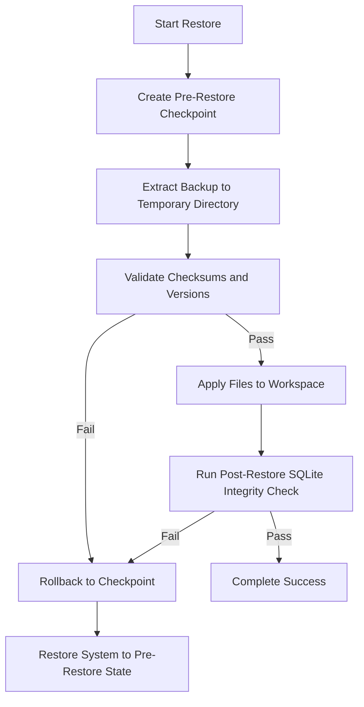

# AAiOS Recovery and Disaster Recovery Guide

This document describes how to recover the Agentic AI Operating System (AAIOS) workspace, databases, and configuration settings in the event of hardware failures, file corruption, or failed upgrades.

---

## 1. Automated Safety Checkpoint and Rollback

To prevent a failed recovery from leaving the system in a broken, half-restored state, the Recovery Manager implements a transactional restoration process:



If any step in validation or database checking fails, the recovery engine automatically deletes the partially copied files and rolls back the workspace to its exact state prior to executing the restore command.

---

## 2. Restoring a Backup

To restore the system to a previous state, locate the desired backup ID and execute:

```bash
aaios backup restore <BACKUP_ID>
```

### Selective Component Restores
You can selectively restore specific parts of the system (e.g. only databases or only configurations) using the `--components` flag:
```bash
# Restore only the database files
aaios backup restore <BACKUP_ID> --components database

# Restore configuration and secrets, leaving databases untouched
aaios backup restore <BACKUP_ID> --components config,secrets
```

---

## 3. Database Schema Verification

After files are applied, the Recovery Manager automatically runs integrity checks on all SQLite databases:
```sql
PRAGMA integrity_check;
```
It also verifies that the active code supports the schema version stored in the database's `schema_migrations` table. If a schema version mismatch is found, it raises an error and triggers the rollback process.

---

## 4. Disaster Recovery Runbook

In the event of a total system failure (e.g. host disk crash):

1.  **Provision new host**: Install Windows and configure Python 3.12+ and Node/pnpm.
2.  **Clone repository**: Clone `https://github.com/rachidSabah/aaios` to the target folder.
3.  **Run Installer**: Execute `.\tasks.ps1 install` to bootstrap environments.
4.  **Copy Backup Archive**: Copy your latest encrypted backup file to `backups/`.
5.  **Restore active key**: Place the historical `backup_key.key` file in `secrets/`.
6.  **Run Restore**:
    ```bash
    aaios backup restore <LATEST_BACKUP_ID>
    ```
7.  **Run validation**:
    ```bash
    aaios validate
    ```
    Ensure that the status returned is `CERTIFIED` and that all checks report `Passed`.
